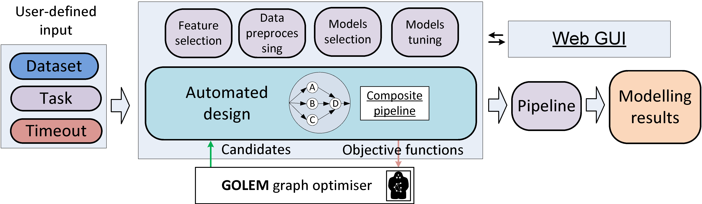

.. |eng| image:: https://img.shields.io/badge/lang-en-red.svg
   :target: /README_en.rst

.. |rus| image:: https://img.shields.io/badge/lang-ru-yellow.svg
   :target: /README.rst

.. start-badges
.. list-table::
   :stub-columns: 1

   * - package
     - | |pypi| |python|
   * - tests
     - | |build| |integration| |coverage|
   * - docs
     - |docs|
   * - license
     - | |license|
   * - stats
     - | |downloads_stats|
   * - support
     - | |tg|
   * - languages
     - | |eng| |rus|
   * - mirror
     - | |gitlab|
   * - funding
     - | |ITMO| |NCCR|
.. end-badges

**FEDOT** - это open-source фреймворк для решения задач из области автоматизированного моделирования и машинного обучения (AutoML). Фреймворк распространяется под лицензией 3-Clause BSD.

FEDOT предоставляет возможность использовать генеративный дизайн для проектирования пайплайнов машинного обучения для различных реальных задач. Ядро фреймворка основано на эволюционном подходе и поддерживает классификацию (бинарную и мультиклассовую), регрессию, и задачи прогнозирования временных рядов.

Ключевой особенностью фреймворка является управление сложными взаимодействиями между различными частями пайплайнов. Они представлены в виде графа, который определяет связи между предварительной обработкой данных и блоками модели.

Проект поддерживается исследовательской группой Natural Systems Simulation Lab, которая является частью `Национального центра когнитивных разработок Университета ИТМО <https://actcognitive.org/>`__.

Более подробная информация о FEDOT доступна в следующем видео:

.. image:: https://res.cloudinary.com/marcomontalbano/image/upload/v1606396758/video_to_markdown/images/youtube--RjbuV6i6de4-c05b58ac6eb4c4700831b2b3070cd403.jpg
   :target: http://www.youtube.com/watch?v=RjbuV6i6de4
   :alt: Introducing Fedot

Концепции FEDOT'а
=================

- **Гибкость.** FEDOT может быть использован для автоматизации поиска решений для различных `классов задач <https://fedot.readthedocs.io/en/master/introduction/fedot_features/main_features.html#involved-tasks>`_, `типов данных <https://fedot.readthedocs.io/en/master/introduction/fedot_features/automation_features.html#data-nature>`_ (тексты, изображения, таблицы), и `моделей <https://fedot.readthedocs.io/en/master/advanced/automated_pipelines_design.html>`_;
- **Расширяемость.** Алгоритмы для оптимизации пайплайнов не зависят от вида данных и задач, однако можно использовать `специальные стратегии <https://fedot.readthedocs.io/en/master/api/strategies.html>`_ для определенных классов задач или типов данных (прогнозирование временных рядов, NLP, табличные данные и т.д.) для повышения эффективности;
- **Интегрируемость.** FEDOT поддерживает широко используемые библиотеки МО (Scikit-learn, CatBoost, XGBoost и т.д.) и позволяет интегрировать `пользовательские библиотеки <https://fedot.readthedocs.io/en/master/api/strategies.html#module-fedot.core.operations.evaluation.custom>`_;
- **Тюнингуемость.** Поддерживаются различные методы `настройки гиперпараметров <https://fedot.readthedocs.io/en/master/advanced/hyperparameters_tuning.html>`_, включая пользовательские метрики оценивания и пространства параметров моделей;
- **Универсальность.** FEDOT `не ограничивается конкретными задачами моделирования <https://fedot.readthedocs.io/en/master/advanced/architecture.html>`_, например, его можно использовать в ODE или PDE;
- **Воспроизводимость.** Получаемые паплайны можно `экспортировать в формате JSON отдельно <https://fedot.readthedocs.io/en/master/advanced/pipeline_import_export.html>`_ или `вместе с входными данными в формате архива ZIP <https://fedot.readthedocs.io/en/master/advanced/project_import_export.html>`_, для воспроизведения экспериментов;
- **Кастомизируемость.** FEDOT позволяет `настраивать сложность моделей <https://fedot.readthedocs.io/en/master/introduction/fedot_features/automation_features.html#models-used>`_, тем самым, получать необходимое качество.

Установка
=========

- Cистема управления пакетами **pip**

Самый простой способ установить FEDOT - это использовать ``pip``:

.. code-block::

  $ pip install fedot

Установка с дополнительными зависимостями для обработки изображений и текста, а также для DNN:

.. code-block::

  $ pip install fedot[extra]

- Контенер **Docker**

Информацию по доступным образам можно посмотреть `здесь <https://github.com/aimclub/FEDOT/tree/master/docker/README.rst>`_.

Как использовать
================

FEDOT предоставляет высокоуровневый API, который удобно использовать. API может использоваться для задач классификации, регрессии и прогнозирования временных рядов.
Чтобы использовать API, выполните следующие действия:

1. Импортируйте класс ``Fedot``

.. code-block:: python

 from fedot.api.main import Fedot

2. Инициализируйте объект FEDOT и задайте тип задачи моделирования. Объект предоставит интерфейс fit/predict:

- ``Fedot.fit()`` запускает оптимизацию и возвращает получившийся составной пайплайн;
- ``Fedot.predict()`` прогнозирует целевые значения для заданных входных данных, используя уже полученный пайплайн;
- ``Fedot.get_metrics()`` оценивает качество предсказаний с использованием выбранных показателей.

В качестве источников входных данных могут использоваться массивы NumPy, датафреймы Pandas и путь к файлу. В приведенном ниже примере ``x_train``, ``y_train`` и ``x_test`` являются ``numpy.ndarray()``:

.. code-block:: python

    model = Fedot(problem='classification', timeout=5, preset='best_quality', n_jobs=-1)
    model.fit(features=x_train, target=y_train)
    prediction = model.predict(features=x_test)
    metrics = model.get_metrics(target=y_test)

Более подробная информация об API доступна в `документации <https://fedot.readthedocs.io/en/latest/api/api.html>`__, а более сложные примеры показаны `в этом разделе <https://github.com/aimclub/FEDOT/tree/master/examples/advanced>`__.

Примеры
=======

Jupyter ноутбуки с примерами находятся в репозитории `fedot-examples <https://github.com/ITMO-NSS-team/fedot-examples>`__. Там вы можете найти следующие руководства:

* `Intro to AutoML <https://github.com/ITMO-NSS-team/fedot-examples/blob/main/notebooks/latest/1_intro_to_automl.ipynb>`__
* `Intro to FEDOT functionality <https://github.com/ITMO-NSS-team/fedot-examples/blob/main/notebooks/latest/2_intro_to_fedot.ipynb>`__
* `Intro to time series forecasting with FEDOT <https://github.com/ITMO-NSS-team/fedot-examples/blob/main/notebooks/latest/3_intro_ts_forecasting.ipynb>`__
* `Advanced time series forecasting <https://github.com/ITMO-NSS-team/fedot-examples/blob/main/notebooks/latest/4_auto_ts_forecasting.ipynb>`__
* `Gap-filling in time series and out-of-sample forecasting <https://github.com/ITMO-NSS-team/fedot-examples/blob/main/notebooks/latest/5_ts_specific_cases.ipynb>`__
* `Hybrid modelling with custom models <https://github.com/ITMO-NSS-team/fedot-examples/blob/main/notebooks/latest/6_hybrid_modelling.ipynb>`__

Версии ноутбуков выпускаются в соответствии с версиями релизов (версия по умолчанию - "latest").

Также доступны примеры на внешних платформах:

* `Kaggle: baseline for Microsoft Stock - Time Series Analysis task <https://www.kaggle.com/dreamlone/microsoft-stocks-price-prediction-automl>`__

Расширенные примеры:

- Задача с кредитным скорингом `binary classification task <https://github.com/aimclub/FEDOT/blob/master/cases/credit_scoring/credit_scoring_problem.py>`__
- Прогнозирование временных рядов `random process regression <https://github.com/aimclub/FEDOT/blob/master/cases/metocean_forecasting_problem.py>`__
- Обнаружение спама `natural language preprocessing <https://github.com/aimclub/FEDOT/blob/master/cases/spam_detection.py>`__
- Предсказание сорта вина `multi-modal data <https://github.com/aimclub/FEDOT/blob/master/examples/advanced/multimodal_text_num_example.py>`__

Также доступно несколько `видео уроков <https://www.youtube.com/playlist?list=PLlbcHj5ytaFUjAxpZf7FbEaanmqpDYhnc>`__ (на русском).

Публикации о FEDOT
==================

Мы опубликовали несколько постов о различных аспектах фреймворка:

На английском:

- How AutoML helps to create composite AI? - `towardsdatascience.com <https://towardsdatascience.com/how-automl-helps-to-create-composite-ai-f09e05287563>`__
- AutoML for time series: definitely a good idea - `towardsdatascience.com <https://towardsdatascience.com/automl-for-time-series-definitely-a-good-idea-c51d39b2b3f>`__
- AutoML for time series: advanced approaches with FEDOT framework - `towardsdatascience.com <https://towardsdatascience.com/automl-for-time-series-advanced-approaches-with-fedot-framework-4f9d8ea3382c>`__
- Winning a flood-forecasting hackathon with hydrology and AutoML - `towardsdatascience.com <https://towardsdatascience.com/winning-a-flood-forecasting-hackathon-with-hydrology-and-automl-156a8a7a4ede>`__
- Clean AutoML for “Dirty” Data - `towardsdatascience.com <https://towardsdatascience.com/clean-automl-for-dirty-data-how-and-why-to-automate-preprocessing-of-tables-in-machine-learning-d79ac87780d3>`__
- FEDOT as a factory of human-competitive results - `youtube.com <https://www.youtube.com/watch?v=9Rhqcsrolb8&ab_channel=NSS-Lab>`__
- Hyperparameters Tuning for Machine Learning Model Ensembles - `towardsdatascience.com <https://towardsdatascience.com/hyperparameters-tuning-for-machine-learning-model-ensembles-8051782b538b>`__

На русском:

- Как AutoML помогает создавать модели композитного ИИ — говорим о структурном обучении и фреймворке FEDOT - `habr.com <https://habr.com/ru/company/spbifmo/blog/558450>`__
- Прогнозирование временных рядов с помощью AutoML - `habr.com <https://habr.com/ru/post/559796/>`__
- Как мы “повернули реки вспять” на Emergency DataHack 2021, объединив гидрологию и AutoML - `habr.com <https://habr.com/ru/post/577886/>`__
- Чистый AutoML для “грязных” данных: как и зачем автоматизировать предобработку таблиц в машинном обучении - `ODS blog <https://habr.com/ru/company/ods/blog/657525/>`__
- Фреймворк автоматического машинного обучения FEDOT (Конференция Highload++ 2022) - `presentation <https://docs.yandex.ru/docs/view?url=ya-disk-public%3A%2F%2Fi27LScu3s3IIHDzIXt9O5EiEAMl6ThY6QLu3X1oYH%2FFiAl%2BLcNp4O4yTSYd2gRZnW5aDQ4kMZEXE%2BwNjbq78ug%3D%3D%3A%2F%D0%94%D0%B5%D0%BD%D1%8C%201%2F4.%D0%A1%D0%B8%D0%BD%D0%BD%D0%B0%D0%BA%D1%81%2F9.Open%20source-%D1%82%D1%80%D0%B8%D0%B1%D1%83%D0%BD%D0%B0_HL_FEDOT.pptx&name=9.Open%20source-%D1%82%D1%80%D0%B8%D0%B1%D1%83%D0%BD%D0%B0_HL_FEDOT.pptx>`__
- Про настройку гиперпараметров ансамблей моделей машинного обучения - `habr.com <https://habr.com/ru/post/672486/>`__

На китайском:

- 生成式自动机器学习系统 (презентация на конференции "Open Innovations 2.0") - `youtube.com <https://www.youtube.com/watch?v=PEET0EbCSCY>`__

Структура проекта
=================

Последняя стабильная версия FEDOT находится в `ветке master <https://github.com/aimclub/FEDOT/tree/master>`__.

Репозиторий включает в себя следующие директории:

* В пакете `core <https://github.com/aimclub/FEDOT/tree/master/fedot/core>`__  находятся основные классы и скрипты. Это *ядро* фреймворка FEDOT.
* В пакете `examples <https://github.com/aimclub/FEDOT/tree/master/examples>`__ собраны несколько примеров использования, с которых можно начать знакомство с FEDOT.
* Все тесты (unit и интеграционные) находятся в папке `test <https://github.com/aimclub/FEDOT/tree/master/test>`__.
* Документация находится в папке `docs <https://github.com/aimclub/FEDOT/tree/master/docs>`__.

Текущие исследования/разработки и планы на будущее
==================================================

В настоящее время мы работаем над новыми функциями и пытаемся улучшить производительность и удобство использования FEDOT.
Основные текущие задачи и планы:

* Реализация методов и алгоритмов мета-обучения
* Повышение эффективности оптимизационного ядра GOLEM.
* Поддержка более сложных вариантов пайплайнов, особенно для задач прогнозирования временных рядов.

Кроме того, мы работаем над рядом исследовательских задач, связанных с бенчмаркингом прогнозирования временных рядов с помощью AutoML и мультимодального моделирования.

Наша научно-исследовательская команда открыта для сотрудничества с другими научными коллективами, а также с партнерами из индустрии.

Документация
============

Подробное описание FEDOT API доступно в разделе `Read the Docs <https://fedot.readthedocs.io/en/latest/>`__.

Как участвовать
===============

- Инструкция для добавления изменений находится в `репозитории <https://github.com/aimclub/FEDOT/blob/master/docs/source/contribution.rst>`__.

Благодарности
=============

Мы благодарны контрибьютерам за их важный вклад, а участникам многочисленных конференций и семинаров - за их ценные советы и предложения.

Дополнительные проекты
======================
- Оптимизационное ядро, вынесенное в библиотеку `GOLEM <https://github.com/aimclub/GOLEM/>`__.
- Прототип реализации Meta-AutoML - `MetaFEDOT <https://github.com/ITMO-NSS-team/MetaFEDOT>`__.
- Прототип web-GUI для FEDOT - `FEDOT.WEB <https://github.com/aimclub/FEDOT.Web>`__.

Контакты
========
- `Telegram-канал <https://t.me/FEDOT_helpdesk>`_  для решения проблем и ответов на вопросы о FEDOT
- Команда `Natural System Simulation <https://itmo-nss-team.github.io/>`_
- `Анна Калюжная <https://scholar.google.com/citations?user=bjiILqcAAAAJ&hl=ru>`_, руководитель (anna.kalyuzhnaya@itmo.ru)
- `Новости <https://t.me/NSS_group>`_
- `Youtube канал <https://www.youtube.com/channel/UC4K9QWaEUpT_p3R4FeDp5jA>`_

Разработка ведётся при поддержке
================================

- `Национальный центр когнитивных разработок Университета ИТМО <https://actcognitive.org/>`_

Цитирование
===========

@article{nikitin2021automated,
  title = {Automated evolutionary approach for the design of composite machine learning pipelines},
  author = {Nikolay O. Nikitin and Pavel Vychuzhanin and Mikhail Sarafanov and Iana S. Polonskaia and Ilia Revin and Irina V. Barabanova and Gleb Maximov and Anna V. Kalyuzhnaya and Alexander Boukhanovsky},
  journal = {Future Generation Computer Systems},
  year = {2021},
  issn = {0167-739X},
  doi = {https://doi.org/10.1016/j.future.2021.08.022}}

@inproceedings{polonskaia2021multi,
  title={Multi-Objective Evolutionary Design of Composite Data-Driven Models},
  author={Polonskaia, Iana S. and Nikitin, Nikolay O. and Revin, Ilia and Vychuzhanin, Pavel and Kalyuzhnaya, Anna V.},
  booktitle={2021 IEEE Congress on Evolutionary Computation (CEC)},
  year={2021},
  pages={926-933},
  doi={10.1109/CEC45853.2021.9504773}}

Другие статьи доступны на `ResearchGate <https://www.researchgate.net/project/Evolutionary-multi-modal-AutoML-with-FEDOT-framework>`_.

.. |docs| image:: https://readthedocs.org/projects/ebonite/badge/?style=flat
   :target: https://fedot.readthedocs.io/en/latest/
   :alt: Documentation Status

.. |build| image:: https://github.com/aimclub/FEDOT/actions/workflows/unit-build.yml/badge.svg
   :alt: Build Status
   :target: https://github.com/aimclub/FEDOT/actions/workflows/unit-build.yml

.. |integration| image:: https://github.com/aimclub/FEDOT/actions/workflows/integration-build.yml/badge.svg
   :alt: Integration Build Status
   :target: https://github.com/aimclub/FEDOT/actions/workflows/integration-build.yml

.. |coverage| image:: https://codecov.io/gh/aimclub/FEDOT/branch/master/graph/badge.svg
   :alt: Coverage Status
   :target: https://codecov.io/gh/aimclub/FEDOT

.. |pypi| image:: https://badge.fury.io/py/fedot.svg
   :alt: Supported Python Versions
   :target: https://badge.fury.io/py/fedot

.. |python| image:: https://img.shields.io/pypi/pyversions/fedot.svg
   :alt: Supported Python Versions
   :target: https://img.shields.io/pypi/pyversions/fedot

.. |license| image:: https://img.shields.io/github/license/aimclub/FEDOT
   :alt: Supported Python Versions
   :target: https://github.com/aimclub/FEDOT/blob/master/LICENSE.md

.. |downloads_stats| image:: https://static.pepy.tech/personalized-badge/fedot?period=total&units=international_system&left_color=grey&right_color=brightgreen&left_text=Downloads
   :target: https://pepy.tech/project/fedot

.. |tg| image:: https://img.shields.io/badge/Telegram-Group-blue.svg
   :target: https://t.me/FEDOT_helpdesk
   :alt: Telegram Chat

.. |ITMO| image:: https://raw.githubusercontent.com/aimclub/open-source-ops/43bb283758b43d75ec1df0a6bb4ae3eb20066323/badges/ITMO_badge_rus.svg
   :alt: Acknowledgement to ITMO
   :target: https://itmo.ru

.. |NCCR| image:: https://raw.githubusercontent.com/aimclub/open-source-ops/43bb283758b43d75ec1df0a6bb4ae3eb20066323/badges/NCCR_badge.svg
   :alt: Acknowledgement to NCCR
   :target: https://actcognitive.org/

.. |gitlab| image:: https://img.shields.io/badge/mirror-GitLab-orange
   :alt: GitLab mirror for this repository
   :target: https://gitlab.actcognitive.org/itmo-nss-team/FEDOT
