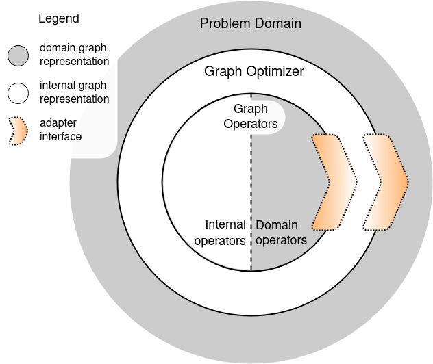

Adaptation of Graphs
====================

Domain Graphs & Optimization Graphs
************************************

Problem domains usually work with their own graph representations that are suitable for specific needs. For example, in the case of AutoML problem (as in FEDOT framework) this is a pipeline of ML operations (a tree or a directed acyclic graph);
in Bayesian optimization this is a graph of variables and their conditional dependencies (as in BAMT framework), in the task of neural architecture search (NAS) the domain graph is a neural network implemented in some deep learning framework, and so on.

Universal graph optimizer abstracts from these details and works with internal graph representation (also called *optimization graph*). This design brings the following benefits:

* **Generality**: graph optimizer is isolated from domain specifics and can be used for a wide range of domains.
* **Domain nativeness**: at the same time isolation enables opaque domain-specific operators and rules, that domain experts can define. Graph fitness is also defined in domain terms.
* **Effectiveness**: optimization works with suitable light-weight structure.
* **Flexibility**: the only requirement for domain structure is convertibility to a graph form. This conversion is the task of the Adapter subsystem.

Adapter Subsystem
*****************

**Adapter** provides automatic 2-way transformation between domain graphs and optimization graphs. Adapter transforms graphs on 2 levels, as schematically represented by the diagram.

* First, on the initial input and the output of the optimizer.

  Initial domain graphs provided by the user are transformed to optimization graphs, and the resulting optimization graphs are transformed back to domain graphs. This the the outer border on the scheme between problem domain and graph optimizer.

* Second, when graph optimizer calls verification rules and graph operators (e.g. evolutionary operators) defined for domain graphs.

  For example, in optimization of 3D structures we could define a domain crossover operator, that merges 3D meshes only along specific planes. To apply this opertor, optimizer first restores the domain graphs from the optimization graphs, then applies the operator, and then adapts the resulting domain graph back into internal representation.

Framework users need to explicitly use the Adapter subsystem in two cases:

* When they instantiate the framework for the new problem domain.

  In this case they must implement their own Adapter, inheriting from the base Adapter (see :py:class:`fedot.core.adapter.adapter.BaseOptimizationAdapter`).

* When they define custom rules or operators *that work on internal optimization graphs*.

  These can be graph verification rules (see :py:class:`fedot.core.dag.graph_verifier.GraphVerifier` class) or custom operators for the evolutionary optimizer. This use-case is less common, because external users usually define rules or operators that work with the domain graphs.
  In this case users should mark these functions with ``@register_native`` decorator. This decorator tells the Adapter that the decorated function works directly on optimization graphs and does not require transformation of its arguments and/or return values.
