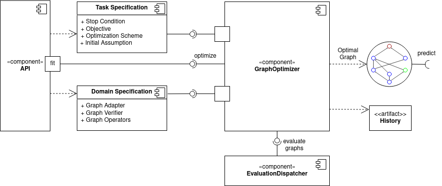

Architecture
============

The framework includes the following components:

* The core is the GraphOptimizer, that outputs optimal graphs after evaluation process.
* GraphOptimizer delegates fitness evaluation of the graphs to EvaluationDispatcher, that handles technical details like caching, multiprocessing, metadata collection etc.
* User specifies parameters of the task and the optimization process through API facade, that setups GraphOptimizer according to them and delegates `fit` calls to it.
* Final optimal graph can be used for predictions.
