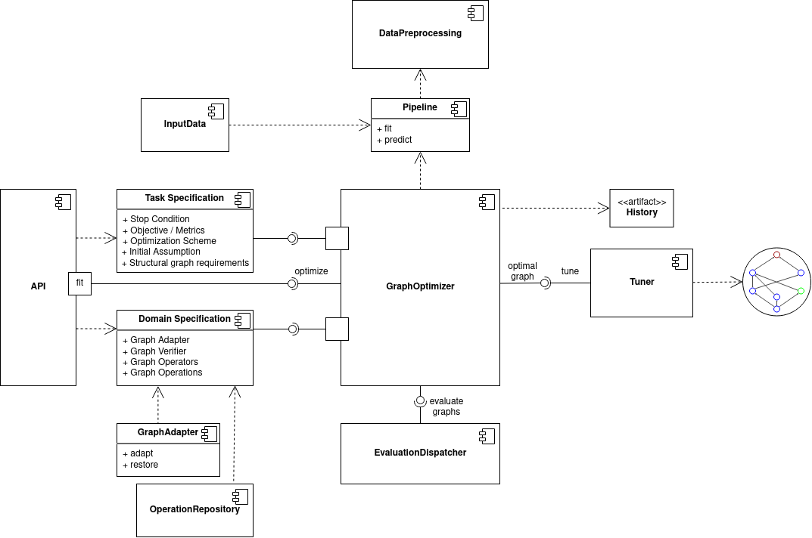

Architecture
============

The framework includes the following components:

* The core is `GOLEM package <https://github.com/aimclub/GOLEM>`_ providing GraphOptimizer, that outputs optimal graphs after evaluation process.
* GraphOptimizer delegates fitness evaluation of the graphs to EvaluationDispatcher, that handles technical details like caching, multiprocessing, metadata collection etc.
* Tuner optimizes hyper-parameters of the final Graph returned by the optimizer.
* API facade that provides a way for the user to specify parameters of the task and the optimization process. It setups GraphOptimizer according to them and delegates `fit` calls to it.

Setup of the framework for the problem domain (e.g. domain of AutoML is realized by FEDOT) requires specification of the following domain specific components:

* Graph Adapter.
* Verification rules for the Graph Verifier.
* Domain-specific operators, that transform graphs during optimization (e.g. evolutionary operators).
* Domain-specific operations, that constitute the graph (e.g. ML operations for AutoML domain in FEDOT, or data variables for Bayesian networks learning in BAMT).

Task specification includes definition of the objective, initial population, requirements for the resulting graph and algorithmic details of optimization.

Optimization of AutoML models includes the following components:

* Pipeline, that defines the wiring of ML operations and data flow (see :py:class:`fedot.core.pipelines.pipeline.Pipeline`).
* InputData with DataPreprocessor (see :py:class:`fedot.core.data.data.InputData` and :doc:`data_preprocessing`), that handle data loading from various formats & preprocessing of the data for ML operations.
* OperationRepository defines the list of available ML operations and their implementations.