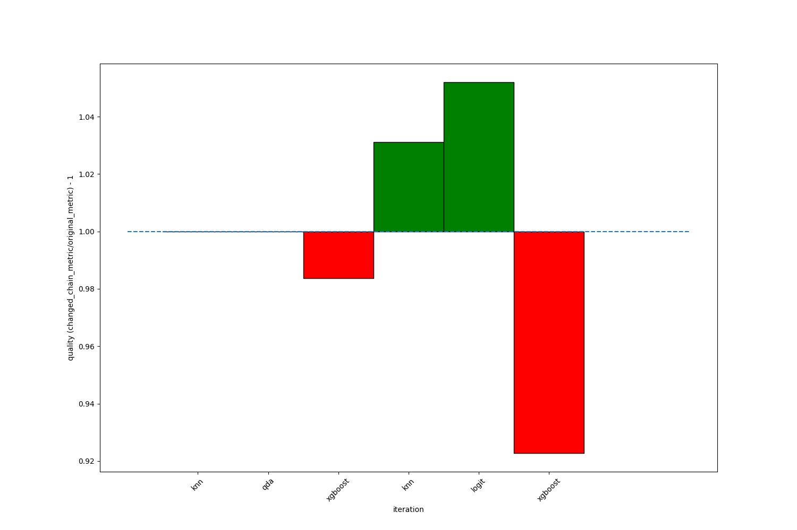
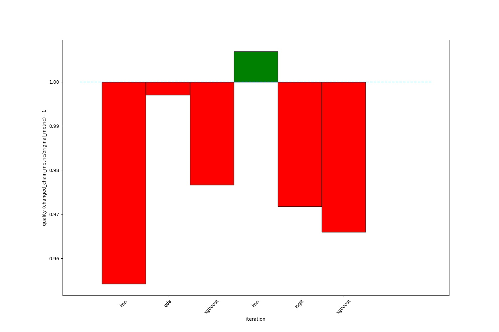
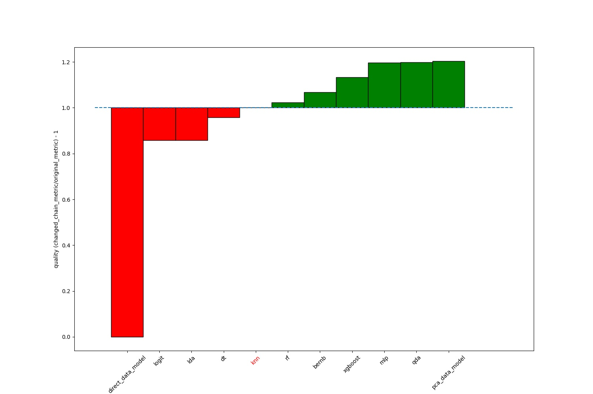
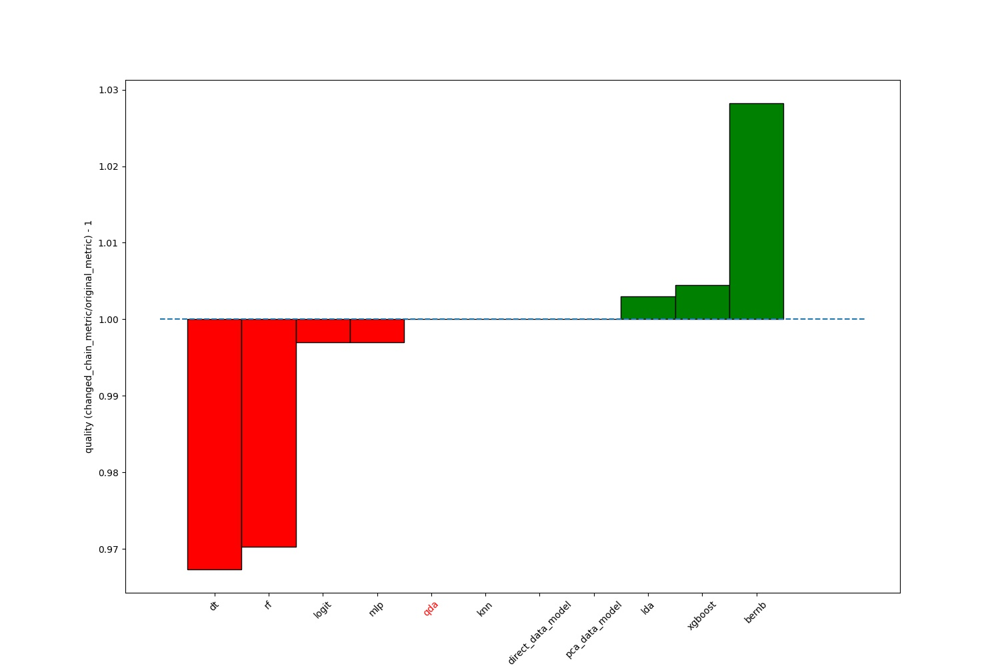

Sensitivity analysis
--------------------

Sensitivity analysis algorithms are used to find uncertainties in the input parameters
of data or in meta-parameters that affect the output. But the model complexity
can also affect the result. To evaluate the potential contribution of certain component
of the composite model we introduce the composite model Sensitivity Analysis (SA). Sensitivity
analysis of composite models includes structure analysis and sensitivity analysis of hyperparameters.

Structural Analysis means structure modification of some sort like Node deletion,
replacement or anything else(see `NodeAnalyzeApproach`_). Within FEDOT, you can apply such an analysis
to the model by using `PipelineAnalysis`_ or `NodeAnalysis`_. The difference is:

* ``PipelineAnalysis`` allows you to apply several approaches to several (all or defined) Nodes;

* ``NodeAnalysis`` allows you to apply several approaches to one Node;

* additionally, you may use every approach directly.

Sensitivity Analysis of hyperparameters is conducted with the Sobol method based on dispersion analysis.
Currently you may analyze hyperparameters of the certain node or all nodes together. The specificity of such
analysis is that some hyperparameters may be dobbled due to components duplication, but have different influence.

PipelineSensitivityAnalysis
~~~~~~~~~~~~~~~~~~~~~~~~~~~

FEDOT allows you to apply all the available SA approaches to all (or certain) the components of the composite
model via ``PipelineSensitivityAnalysis``

.. code-block:: python

     from fedot.core.pipelines.pipeline import Pipeline
     from fedot.core.data.data import InputData
     from fedot.sensitivity.pipeline_sensitivity import PipelineStructureAnalyze
     from fedot.sensitivity.node_sensitivity import \
     NodeDeletionAnalyze, NodeReplaceModelAnalyze

     pipeline = Pipeline()
     train_data = InputData.from_csv('train_file.csv')
     test_data = InputData.from_csv('test_file.csv')
     approaches = [NodeDeletionAnalyze, NodeReplaceOperationAnalyze, MultiOperationsHPAnalyze]

     PipelineSensitivityAnalysis(pipeline=pipeline, train_data=train_data,
                             test_data=test_data, approaches=approaches,
                             requirements=sa_requirements, path_to_save=result_path).analyze()

PipelineStructureAnalysis
~~~~~~~~~~~~~~~~~~~~~~~~~

Conduct only composite model structure analysis via ``NodesAnalysis``,
which analyzes nodes separately from each other. Currently, the
application of ``NodeDeletionAnalyze`` and ``NodeReplaceModelAnalyze``
gives node a rating, thus you understand the influence of the component
on the composite model. The rating corresponds to:

-  Rating 1 - Redundant node (Deletion is recommended)

-  Rating 2 - Uncertain node (Extra analysis is recommended. In other
   words, it is needed to decide which one of deletion or replacement
   with the best found operation leads to higher improvement)

-  Rating 3 - Imprecise node (Replacement is recommended)

-  Rating 4 - Precise node (Stay as it is)

.. code-block:: python

     from fedot.core.pipelines.pipeline import Pipeline
     from fedot.core.data.data import InputData
     from fedot.sensitivity.pipeline_sensitivity import PipelineStructureAnalyze
     from fedot.sensitivity.node_sensitivity import \
     NodeDeletionAnalyze, NodeReplaceModelAnalyze

     pipeline = Pipeline()
     train_data = InputData.from_csv('train_file.csv')
     test_data = InputData.from_csv('test_file.csv')
     approaches = [NodeDeletionAnalyze, NodeReplaceModelAnalyze]
     analysis_result = NodesAnalysis(pipeline=pipeline,
                                     train_data=train_data,
                                     test_data=test_data,
                                     approaches=nodes_analyze_approaches,
                                     requirements=requirements,
                                     nodes_to_analyze=nodes_to_analyze,
                                     path_to_save=path_to_save, log=log).analyze()

NodeAnalysis
~~~~~~~~~~~~

.. code-block:: python

     from fedot.core.pipelines.pipeline import Pipeline
     from fedot.core.data.data import InputData
     from fedot.sensitivity.node_sensitivity import \
     NodeDeletionAnalyze, NodeAnalysis, NodeReplaceModelAnalyze

     pipeline = Pipeline()
     node_id_to_analyze = 2
     train_data = InputData.from_csv('train_file.csv')
     test_data = InputData.from_csv('test_file.csv')
     approaches = [NodeDeletionAnalyze, NodeReplaceModelAnalyze, OneOperationHPAnalyze]

     node_result = NodeAnalysis(approaches=approaches). \
                analyze(pipeline=self.pipeline, node_id=node_id_to_analyze,
                        train_data=self.train_data,
                        test_data=self.test_data)

The evaluation result represents the ratio of origin quality score to score of the modified model.
After SA there will be a json file(default location at ``~home\Fedot\sensitivity``)
including the results per Node and detailed visualisation.

Result file example:

.. code-block:: json

     {
        "id = 0, model = knn": {
            "NodeDeletionAnalyze": 1.0,
            "NodeReplaceModelAnalyze": 0.9542077536133998
        },
        "id = 1, model = qda": {
            "NodeDeletionAnalyze": 1.0,
            "NodeReplaceModelAnalyze": 0.9970282317979198
        },
        "id = 2, model = xgboost": {
            "NodeDeletionAnalyze": 0.9836552748885586,
            "NodeReplaceModelAnalyze": 0.9766310955018235
        },
        "id = 3, model = knn": {
            "NodeDeletionAnalyze": 1.0312035661218424,
            "NodeReplaceModelAnalyze": 1.0068890990139132
        },
        "id = 4, model = logit": {
            "NodeDeletionAnalyze": 1.052005943536404,
            "NodeReplaceModelAnalyze": 0.9717682020802377
        },
        "id = 5, model = xgboost": {
            "NodeDeletionAnalyze": 0.9227340267459138,
            "NodeReplaceModelAnalyze": 0.965959746048899
        }
    }

Result visualization example:

What if to delete or replace every node in the pipeline

|DeletionAnalysis| |ReplacementAnalysis|

What if to replace original model(in red) to the certain one

|id_0| |id_1|

.. _PipelineAnalysis: https://fedot.readthedocs.io/en/latest/api/sensitivity.html#fedot.sensitivity.pipeline_sensitivity.PipelineAnalysis
.. _NodeAnalysis: https://fedot.readthedocs.io/en/latest/api/sensitivity.html#fedot.sensitivity.node_sensitivity.NodeAnalysis
.. _NodeAnalyzeApproach: https://fedot.readthedocs.io/en/latest/api/sensitivity.html#fedot.sensitivity.node_sensitivity.NodeAnalyzeApproach
