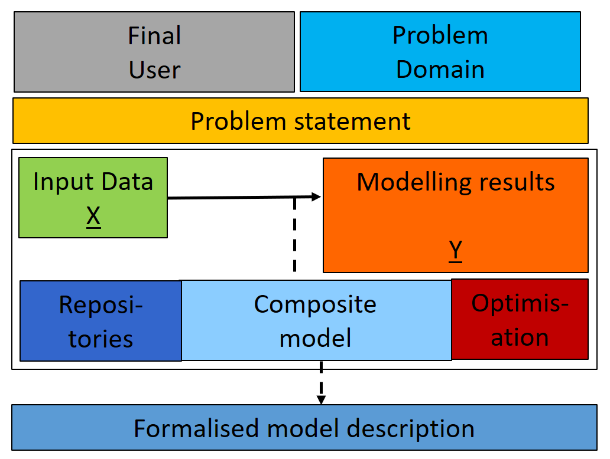

Composite models
================

Composite model is a heterogeneous model that consists of several
heterogeneous models [1]. The structure of the composite model usually
can be represented as a oriented acyclic graph (DAG). A special case of
this structure is an ensemble of models (can be single or multi-level).

The modelling task can be solved with the composite model if following
way:

Formalisation
-------------

The structure of the composite model can be represented as a chain C,
which consists of a set of various machine learning models M = { M\_1,
..., M\_n } and a directed link between them L = { L\_1, ..., L\_k } .

Each link L represents the data flow from the output of model M\_i to
one of the M\_j inputs. The model M\_j can receive several data flows,
so its output can be represented as Y\_j=M\_j(M\_{i1},...M\_{ik}). The
initial (primary) models in the chain are initialized by input data X
directly. Also, each model M\_i is initialized by a set of
hyperparameters P\_{i}. The structure of the chain C(M, L, P) can be
represented as a directed acyclic graph (DAG), where the vertices
correspond to models M and the edges correspond to links L.

Multi-scale composite models
----------------------------

The submodel of composite model can represent different scales of the
target process. The structure of composite model for the multi-scale
process:

[1] Kovalchuk, S.V., Metsker, O.G., Funkner, A.A., Kisliakovskii, I.O.,
Nikitin, N.O., Kalyuzhnaya, A.V., Vaganov, D.A., Bochenina, K.O.,
2018.252A conceptual approach to complex model management with
generalized modelling patterns and evolutionary identification.
Complexity 2018
