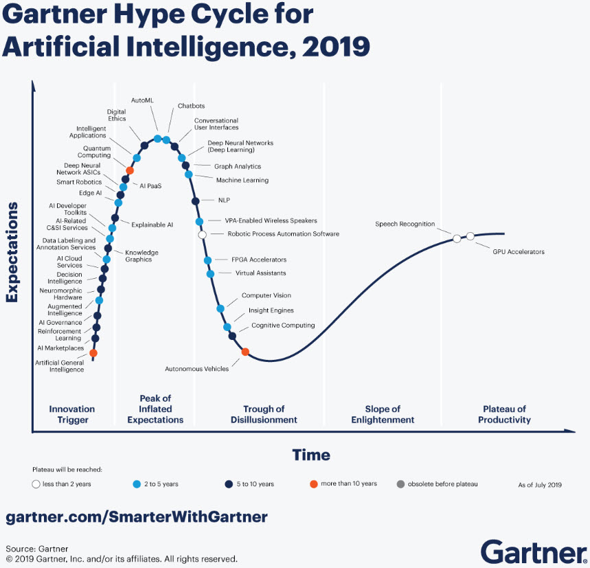
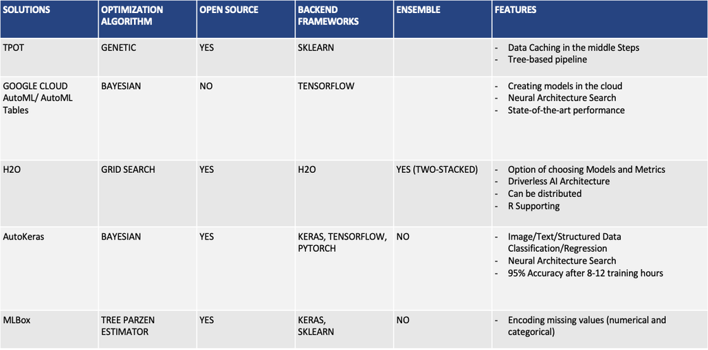

Automated learning
==================

The articles in this section described the different aspects of the
automatic learning of the models. The specific case of the automatic
learning is AutoML.

What is AutoML?
---------------

AutoML is the concept of automating the process of applying machine
learning to real-world problems. AutoML solves problems of parameter
optimization, feature selection, model type selection, etc.

The relevance of the AutoML is very significant these days:

**Two main problems of automatic training of ML-models in solving of application tasks**:

-  Inability to obtain acceptable quality;
-  Not interpretable structure of model;

Popular competitive AutoML-solutions
-------------------------------------

The brief survey of existing solutions:

- Autosklearn
- AutoKeras
- H2O
- Google Colud HyperTune
- Microsoft Automated ML
- TPOP
- Hyperopt
- PyBrain

What is generative machine learning?
------------------------------------

Generative AutoML solves the problems of growing new data-driven models,
new chains, ensembles or other compositions from already existing
models, etc. These days, ideas of low-level "assembly" of the model for
custom problem setting are implemented only in the context of NAS
(Neural Architecture Search) direction and mainly for problems of
pattern recognition. However, for all other classes of tasks and models
(the application of which may be more effective than neural networks),
these approaches are not implemented.

**The basic problems which can be solved by the Generative AutoML are as follows:**

* Lack of solutions for automation of the modeling process to solve custom problems (AutoML should be more omnivorous);
* The difficulty of applying new modeling techniques without re-implementing existing management solutions (ML should be simpler and more flexible to manage);
* Lack of established approaches to improving the reproducibility of the ML results (ML should be reproducible)

The goal of the Generative AutoML implementation is to improve the
quality of analysis of various natural, technical and social processes
by identifying composite models based on available data sets.

Modern AutoML
-------------
.. toctree::
   :glob:
   :maxdepth: 1

   automl
   composite
   knowledge
