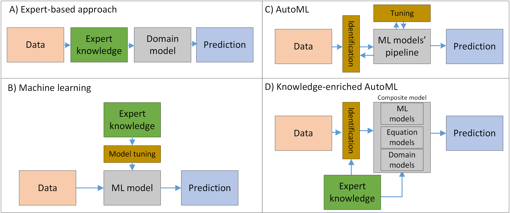

Knowledge-enrichment in the automatic learning
==============================================

There are various approaches to automatic learning exists:

Today, the ML-based solutions often lose to solutions based on
domain-specific models. For example, a lot of physics-based problems can
be solved more efficiently with equation-based models: both data-driven
and domain-specific numerical models. Also, the simulation quality can
be increased using the hybrid approach [1]

The integration of the domain knowledge to the ML-based solutions is a
promising way to achieve a better quality of predictions, as well as the
identification of data-driven models with custom structure [2].

Also, the expert knowledge involvement allows improving the quality of
auto-generated models [3].

References
----------

[1] Fearghal O’Donncha, Yushan Zhang, Bei Chen, and Scott C James. 2018.
An integrated framework that combines machine learning and numerical
models to improve wave-condition forecasts. Journal of Marine Systems
186 (2018), 29–36

[2] Hvatov A., Maslyaev M. The data-driven physical-based equations
discovery using evolutionary approach //arXiv preprint arXiv:2004.01680.
– 2020.

[3] Doris Jung-Lin Lee, Stephen Macke, Doris Xin, Angela Lee, Silu
Huang, and Aditya Parameswaran. 2019. A Human-in-the-loop Perspective on
AutoML: Milestones and the Road Ahead. Data Engineering 58 (2019).
