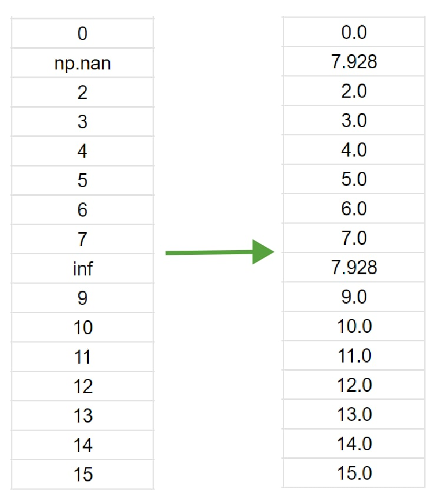
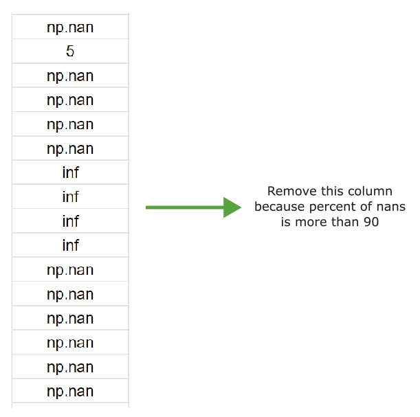
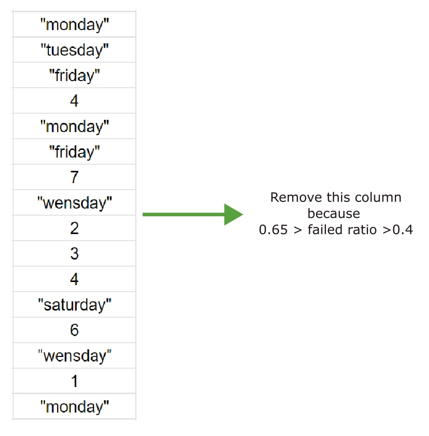
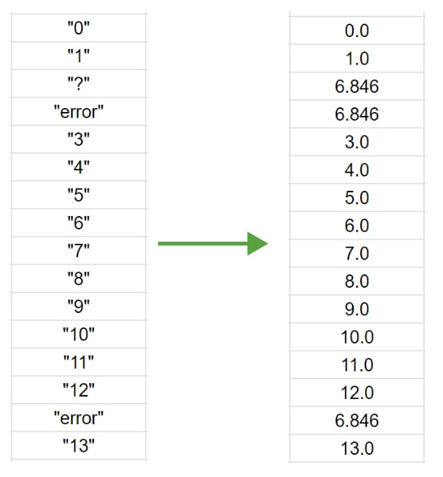

Data Preprocessing
========

Preprocessing for tabular data
--------

Preprocessing for tabular data in FEDOT can be represented as the following block diagram:

|Block diagram|

Such approach to preprocessing allows to get the real data type
and minimize the number of dropped columns due to unrecognized data

The processing of the following samples of data well demonstrates the result of preprocessing in FEDOT.

- gap filling:

|gap filling|

-column remove if too many nans:

|nans|

- column revome if the data is too ambiguous:

|failed ratio|

- cast to a single type:

|one type|

- reduction to a binary classification problem:

|binary|

And the same data after FEDOT preprocessing:

Also for more flexible approach to preprocessing there are 2 variables to control data conversion:

- numerical_min_uniques -- if number of unique values in the column lower, than threshold - convert column into categorical. Default: 13
- categorical_max_classes_th -- if categorical column contains too much unique values convert it into numerical. Default: None

For example, for column converting to numerical if the number of unique values in the column is greater than 5:

.. code:: python

    # pipeline for which to set params
    pipeline = Pipeline(PrimaryNode('dt'))
    pipeline = correct_preprocessing_params(pipeline, numerical_min_uniques=5)

After this preprocessing with this pipeline will be performed according to the specified conditions.

.. |binary| image:: img_utilities/binary.jpg
   :width: 25%
   :align: center

.. |Block diagram| image:: img_utilities/fedot_preprocessing_tabular.png
   :width: 70%
   :align: center
