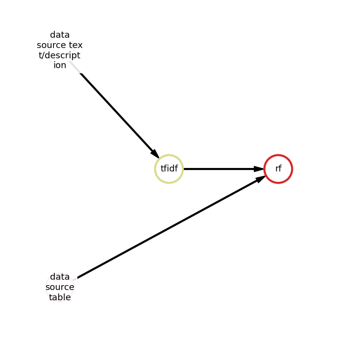

Multi-Modal Tasks
=================

**FEDOT** can solve not only classical tabular data problems, but also problems with multimodal data. In this section, we will consider the main features of the framework for solving such problems.

**Multimodal data** is data that has a different nature (tables, text, images, time series). Humans perceive the world in a multimodal way, so using this approach in machine learning can also work. Indeed, the sharing of several types of data improves the quality of the model at the expense of information that may be contained in one modality and absent in another.

FEDOT's API supports multimodal data from the box. The only thing you need is to load data using ``MultiModalData`` class:

.. code-block:: python

    from fedot.api.main import Fedot
    from fedot.core.data.data_split import train_test_data_setup
    from fedot.core.data.multi_modal import MultiModalData

    data = MultiModalData.from_csv(file_path='multimodal_dataset.csv', task='classification', target_columns='target_column',
                                   text_columns=['text_col1', 'text_col2'], columns_to_drop=['col_to_drop1', 'col_to_drop2'], index_col=None)
    fit_data, predict_data = train_test_data_setup(data, shuffle_flag=True, split_ratio=0.7)

Using ``from_csv()`` method, you should define the task type, and target columns. FEDOT can find text columns automatically, but you can set them manually. You can also select columns which will be dropped from the original dataset. By default, FEDOT reads the first column of every dataset as an index column. If there is no index columns in the dataset, you should set ``index_col=None``.
Initialize the FEDOT object and define the type of modeling problem.

.. code-block:: python

    model = Fedot(problem='classification', timeout=10)

.. note::

    Class ``Fedot.__init__()`` has more than two params, e.g. ``preset`` for choosing the set of models or
    ``n_jobs`` for parallelization. For more details, see the :doc:`FEDOT API </api/api>` section in our documentation.

The ``fit()`` method begins the optimization and returns the resulting composite pipeline.

.. code-block:: python

    model.fit(features=fit_data, target=fit_data.target)

After the fitting is completed, you can look at the structure of the resulting pipeline.

In text format:

.. code-block:: python

    model.current_pipeline.print_structure()

Output:

.. code-block:: text

    Pipeline structure:
    {'depth': 3, 'length': 4, 'nodes': [rf, data_source_table, tfidf, data_source_text/description]}
    rf - {'n_jobs': -1, 'bootstrap': False, 'criterion': 'gini', 'max_features': 0.09622420420481334, 'min_samples_leaf': 1, 'min_samples_split': 8}
    data_source_table - {}
    tfidf - {'min_df': 0.026548403557843454, 'max_df': 0.9547108243944858, 'ngram_range': (1, 2)}
    data_source_text/description - {}

And in plot format:

.. code-block:: python

    model.current_pipeline.show()

|pipeline_structure|

The ``predict()`` method, which uses an already fitted pipeline, returns values for the target.

.. code-block:: python

    prediction = model.predict(predict_data)

The ``get_metrics()`` method estimates the quality of predictions according the selected metrics.

.. code-block:: python

    prediction = model.get_metrics()

Example of using FEDOT for multimodal data classification on Wine Reviews dataset:

.. automodule:: examples.advanced.multimodal_text_num_example
   :members:
   :no-undoc-members:

.. hint::

    `Tutorial on using FEDOT for multimodal data classification <https://github.com/ITMO-NSS-team/fedot-examples/blob/main/notebooks/latest/7_multimodal_data.ipynb>`_
