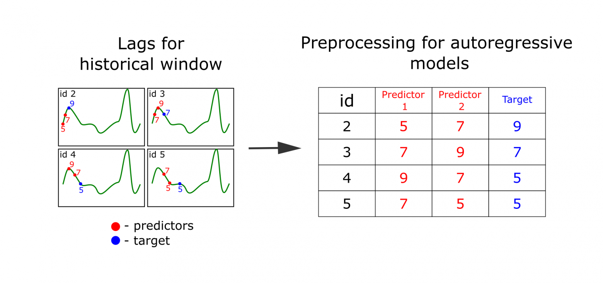
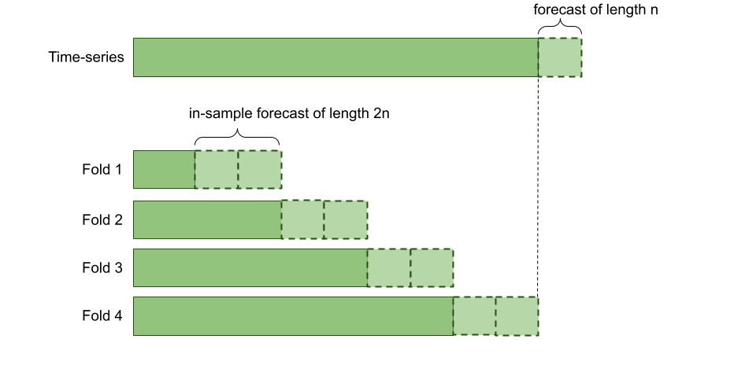
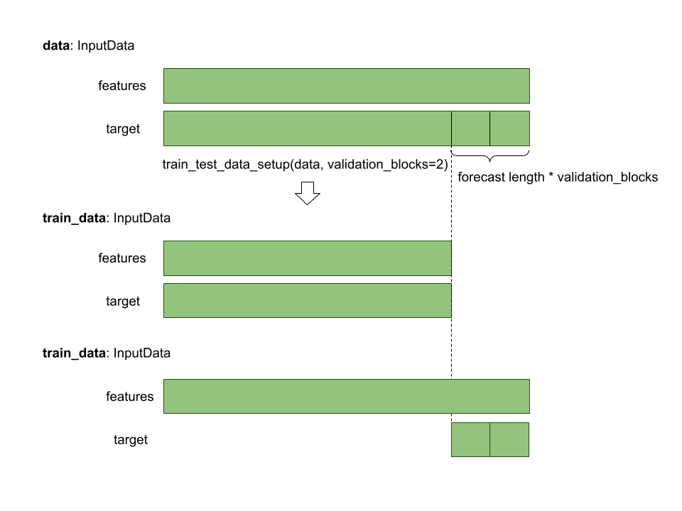

Time Series Forecasting
=======================

FEDOT allows you to automate machine learning pipeline design for time-series forecasting.
To extract features FEDOT uses lagged transformation (windowing method) which allows to represent time-series as
trajectory matrix and apply regression methods for forecasting.
Therefore not only specific models for time series forecasting (such as
ARIMA and AR) can be used but also any machine learning method (knn, decision tree, etc.).
Time-series specific preprocessing methods,
like moving average smoothing or Gaussian smoothing are used as well.

|windowing|

Simple example
~~~~~~~~~~~~~~

.. code-block:: python

    import numpy as np
    from fedot.api.main import Fedot
    from fedot.core.data.data import InputData
    from fedot.core.data.data_split import train_test_data_setup
    from fedot.core.repository.tasks import Task, TaskTypesEnum, TsForecastingParams

    validation_blocks = 2

    task = Task(TaskTypesEnum.ts_forecasting,
                TsForecastingParams(forecast_length=4))

    train_input = InputData.from_csv_time_series(task=task,
                                                 file_path='time_series.csv',
                                                 delimiter=',',
                                                 target_column = 'value')

    train_data, test_data = train_test_data_setup(train_input,
                                                  validation_blocks=validation_blocks)

    # init model for the time series forecasting
    model = Fedot(problem='ts_forecasting',
                  task_params=task.task_params,
                  timeout=10,
                  n_jobs=-1,
                  cv_folds=2,
                  validation_blocks=validation_blocks,
                  preset='fast_train')

    # run AutoML model design
    pipeline = model.fit(train_data)
    pipeline.show()

    # use model to obtain forecast
    forecast = model.predict(test_data)
    target = np.ravel(test_data.target)
    print(model.get_metrics(metric_names=['rmse', 'mae', 'mape'], target=target))

    # plot forecasting result
    model.plot_prediction()

Time-series validation
~~~~~~~~~~~~~~~~~~~~~~

While using FEDOT for forecasting you can set two parameters that will effect
the way pipelines are evaluated during structural design:

- ``cv_folds``
- ``validation_blocks``

Let's consider meaning of these parameters.

There are to approaches to time-series forecasting: in-sample and out-of-sample.
For example, our trained model forecasts 10 values ahead, but we want to forecast 20 values.
With out-of-sample approach we would predict 10 values and then use those values to forecast
another 10 values. But with in-sample approach we forecast already known parts of
time-series. And after forecasting first 10 values we would use real values from timeseries
to forecast next 10 values.

FEDOT uses in-sample forecasting for time-series validation. ``validation_blocks`` specifies
number of steps made during in-sample forecast.

For instance, ``forecast length=10`` and
``validation_blocks=3`` then while validation in-sample forecast of length
``forecast_length * validation_blocks = 30`` will be used.

``cv_folds`` parameter sets number of folds for cross validation of a time-series.

Finally, using ``cv_folds`` and ``validation_blocks`` together will result in splittinq
a time-series into ``cv_folds`` number of folds and applying in-sample forecast with
``validation_blocks`` number of steps in each fold.

|ts_cv|

Train test split
~~~~~~~~~~~~~~~~

To split InputData use ``train_test_data_setup`` method.
``split_ratio`` and ``shuffle_flag`` are ignored for time-series forecasting.

.. automethod:: fedot.core.data.data_split.train_test_data_setup

The method uses ``forecast_length`` specified in the ``data.task``.
In these case:

- ``train_data.features = data.features[:-forecast_length]``
- ``train_data.target = data.target[:-forecast_length]``
- ``test_data.features = data.features[:-forecast_length]``
- ``train_data.target = data.target[-forecast_length:]``

|train_test_split|

If you pass keyword argument ``validation_blocks`` train data will be prepared for in-sample
validation with ``validation_blocks`` number of steps. In these case:

- ``train_data.features = data.features[:-forecast_length * validation_blocks]``
- ``train_data.target = data.target[:-forecast_length * validation_blocks]``
- ``test_data.features = data.features``
- ``train_data.target = data.target[-forecast_length * validation_blocks:]``

|train_test_split_val|

Prediction
~~~~~~~~~~

Multiple time-series forecasting
~~~~~~~~~~~~~~~~~~~~~~~~~~~~~~~~

Gap-filling
~~~~~~~~~~~

Fitted values
~~~~~~~~~~~~~

Examples
~~~~~~~~

**Simple**

* `Forecasting with FEDOT API <https://github.com/nccr-itmo/FEDOT/blob/master/examples/simple/time_series_forecasting/api_forecasting.py>`_
* `Forecasting using clstm <https://github.com/nccr-itmo/FEDOT/blob/master/examples/simple/time_series_forecasting/clstm.py>`_
* `Fitted values <https://github.com/nccr-itmo/FEDOT/blob/master/examples/simple/time_series_forecasting/fitted_values.py>`_
* `Time-series gap-filling <https://github.com/nccr-itmo/FEDOT/blob/master/examples/simple/time_series_forecasting/gapfilling.py>`_
* `Pipeline tuning for time series forecasting <https://github.com/nccr-itmo/FEDOT/blob/master/examples/simple/time_series_forecasting/tuning_pipelines.py>`_

**Advanced**

* `Composing ts pipelines with composer <https://github.com/nccr-itmo/FEDOT/blob/master/examples/advanced/time_series_forecasting/composing_pipelines.py>`_
* `Forecasting with using exogenous features <https://github.com/nccr-itmo/FEDOT/blob/master/examples/advanced/time_series_forecasting/exogenous.py>`_
* `Out-of-sample forecasting <https://github.com/nccr-itmo/FEDOT/blob/master/examples/advanced/time_series_forecasting/multistep.py>`_
* `Tuning pipelines with sparse_lagged / lagged node  <https://github.com/nccr-itmo/FEDOT/blob/master/examples/advanced/time_series_forecasting/sparse_lagged_tuning.py>`_
* `Topaz multi time series forecasting <https://github.com/nccr-itmo/FEDOT/blob/master/examples/advanced/time_series_forecasting/multi_ts_arctic_forecasting.py>`_

**Cases**

* `Case: river level forecasting with composer <https://github.com/nccr-itmo/FEDOT/blob/master/cases/river_levels_prediction/river_level_case_composer.py>`_
* `Case: river level forecasting (manual) <https://github.com/nccr-itmo/FEDOT/blob/master/cases/river_levels_prediction/river_level_case_manual.py>`_

