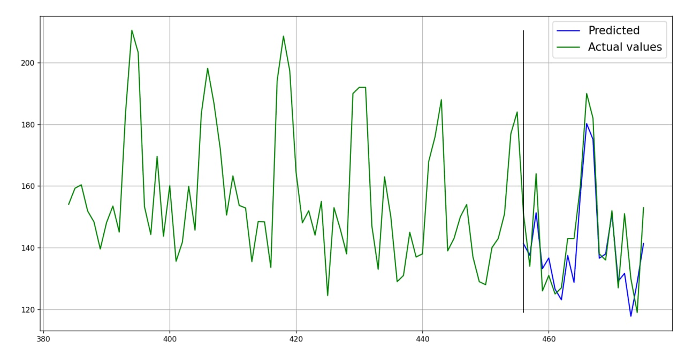
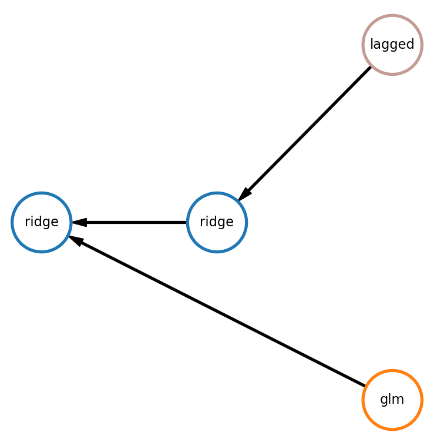

Time Series Forecasting
=======================

FEDOT allows you to automate machine learning pipeline design for time-series forecasting.

To extract features FEDOT uses lagged transformation (windowing method) which allows to represent time-series as
trajectory matrix and apply regression methods for forecasting.
Therefore not only specific models for time series forecasting (such as
ARIMA and AR) can be used but also any machine learning method (knn, decision tree, etc.).

Time-series specific preprocessing methods,
like moving average smoothing or Gaussian smoothing are used as well.

|windowing|


Simple example
~~~~~~~~~~~~~~~

.. code-block:: python

    from fedot.api.main import Fedot
    from fedot.core.data.data import InputData
    from fedot.core.data.data_split import train_test_data_setup
    from fedot.core.repository.tasks import Task, TaskTypesEnum, TsForecastingParams

    task = Task(TaskTypesEnum.ts_forecasting,
                TsForecastingParams(forecast_length=10))  # forecast_length - required depth of forecast

    train_input = InputData.from_csv_time_series(task=task,
                                                 file_path='time_series.csv',
                                                 delimiter=',',
                                                 target_column='value')

    train_data, test_data = train_test_data_setup(train_input)

    # init model for the time series forecasting
    model = Fedot(problem='ts_forecasting', task_params=task.task_params)

    # run AutoML model design
    pipeline = model.fit(train_data)
    # plot obtained pipeline
    pipeline.show()

    # use model to obtain out-of-sample forecast with one step
    forecast = model.forecast(test_data)
    print(model.get_metrics(metric_names=['rmse', 'mae', 'mape'], target=test_data.target))

    # plot forecasting result
    model.plot_prediction()

Sample output:

Pipeline plot from the example:


|simple_ts_pipeline|


Here:

- glm - Generalized linear model
- lasso - Lasso regression,
- lagged - Lagged transformation,
- ridge - Ridge regression.

In the first branch generalized linear model is applied to obtain forecast. In the second branch
lagged transformation is used to transform time-series into table data and then lasso is applied.
Finally, ridge model uses forecasts of two branches to generate final prediction.

Obtained metrics:

.. code-block:: python

    {'rmse': 10.386, 'mae': 9.170, 'mape': 0.064}

Plot of the forecast:

|simple_forecast|


Automated
---------

Use FEDOT in automated mode to get pipeline for time-series forecasting.

.. code-block:: python

    from fedot.api.main import Fedot
    from fedot.core.data.data import InputData
    from fedot.core.data.data_split import train_test_data_setup
    from fedot.core.repository.tasks import Task, TaskTypesEnum, TsForecastingParams

    task = Task(TaskTypesEnum.ts_forecasting,
                TsForecastingParams(forecast_length=10)) # forecast_length - required depth of forecast

    train_input = InputData.from_csv_time_series(task=task,
                                                 file_path='time_series.csv',
                                                 delimiter=',',
                                                 target_column = 'value')

    train_data, test_data = train_test_data_setup(train_input, validation_blocks=2)

    # init model for the time series forecasting
    model = Fedot(problem='ts_forecasting',
                  task_params=task.task_params,
                  timeout=10,
                  n_jobs=-1,
                  cv_folds=2,
                  validation_blocks=2, # number of forecasting steps used during model validation
                  preset='fast_train')

    # run AutoML model design
    pipeline = model.fit(train_data)
    # plot obtained pipeline
    pipeline.show()

    # use model to obtain in-sample forecast with two steps
    # by default number of steps is equal to `validation_blocks` specified for a model
    forecast = model.predict(test_data)
    print(model.get_metrics(metric_names=['rmse', 'mae', 'mape'], target=test_data.target))

    # plot forecasting result
    model.plot_prediction()

Sample output:

Pipeline plot from the example:


|ts_pipeline_auto|


Here:

- polyfit - Polynomial interpolation,
- lagged - Lagged transformation,
- ridge - Ridge regression.

In the first branch polynomial interpolation is applied to obtain forecast. In the second branch
lagged transformation is used to transform time-series into table data and then ridge is applied.
Finally, another ridge model uses forecasts of two branches to generate final prediction.

Obtained metrics:

.. code-block:: python

    {'rmse': 8.485, 'mae': 6.904, 'mape': 0.049}

Plot of the forecast:

|sample_forecast|




Manual
------

Use FEDOT in manual mode to fit your own pipeline for time-series forecasting.

Examples of time-series pipelines can be found `here`_.

.. code-block:: python

    from fedot.api.main import Fedot
    from fedot.core.data.data import InputData
    from fedot.core.data.data_split import train_test_data_setup
    from fedot.core.pipelines.pipeline_builder import PipelineBuilder
    from fedot.core.repository.tasks import Task, TaskTypesEnum, TsForecastingParams

    pipeline = PipelineBuilder() \
        .add_sequence('lagged', 'ridge', branch_idx=0) \
        .add_sequence('glm', branch_idx=1).join_branches('ridge').to_pipeline()

    task = Task(TaskTypesEnum.ts_forecasting,
                TsForecastingParams(forecast_length=10))

    train_input = InputData.from_csv_time_series(task=task,
                                                 file_path='time_series.csv',
                                                 delimiter=',',
                                                 target_column='value')

    train_data, test_data = train_test_data_setup(train_input)

    # init model for the time series forecasting
    model = Fedot(problem='ts_forecasting',
                  task_params=task.task_params)

    model.fit(train_data, predefined_model=pipeline)

    # use model to obtain one-step out-of-sample forecast
    forecast = model.forecast(test_data)
    print(model.get_metrics(metric_names=['rmse', 'mae', 'mape'], target=test_data.target))

    # plot forecasting result
    model.plot_prediction()

Sample output:

Pipeline plot from the example:

|ts_pipeline|



Here:

- glm - Generalized linear model,
- lagged - Lagged transformation,
- ridge - Ridge regression.

In the first branch
lagged transformation is used to transform time-series into table data and then ridge is applied.
In the second branch generalized linear model is applied to obtain forecast.
Finally, another ridge model uses forecasts of two branches to generate final prediction.

Obtained metric:

.. code-block:: python

    {'rmse': 2.659, 'mae': 2.142, 'mape': 0.100}

Plot of the forecast:

|manual_sample_forecast|


.. _Time-series validation:

Time-series validation
~~~~~~~~~~~~~~~~~~~~~~

While using FEDOT for forecasting you can set two parameters that will effect
the way pipelines are evaluated during structural design:

- ``cv_folds``
- ``validation_blocks``

Let's consider meaning of these parameters.

There are to approaches to time-series forecasting: in-sample and out-of-sample.
For example, our trained model forecasts 10 values ahead and our training sample length is 100. With in-sample
forecast we will predict 10 last values of our training sample using 90 first values as prehistory.
With out-of-sample we will predict 10 future values of the training sample using the whole sample of 100 values
as prehistory.

To obtain forecast with length exceeding the forecast length (depth) model was trained for, we use iterative prediction.
For example, our trained model forecasts 10 values ahead, but we want to forecast 20 values.
With out-of-sample approach we would predict 10 values and then use those values to forecast
another 10 values. But with in-sample approach we forecast already known parts of
time-series. And after forecasting first 10 values we would use real values from timeseries
to forecast next 10 values.

FEDOT uses in-sample forecasting for time-series validation. ``validation_blocks`` specifies
number of steps made during in-sample forecast.

For instance, ``forecast length=10`` and
``validation_blocks=3`` then while validation in-sample forecast of length
``forecast_length * validation_blocks = 30`` will be used.

``cv_folds`` parameter sets number of folds for cross validation of a time-series.

Finally, using ``cv_folds`` and ``validation_blocks`` together will result in splittinq
a time-series into ``cv_folds`` number of folds and applying in-sample forecast with
``validation_blocks`` number of steps in each fold.

|ts_cv|


Train test split
~~~~~~~~~~~~~~~~

To split InputData use ``train_test_data_setup`` method.
``split_ratio`` and ``shuffle_flag`` are ignored for time-series forecasting.

.. autofunction:: fedot.core.data.data_split.train_test_data_setup

The method uses ``forecast_length`` specified in the ``data.task``. This approach can be used to
obtain ```test_data``` for **out-of-sample** forecast after training a model on the ```train_data```.
The resulting split:

- ``train_data.features = data.features[:-forecast_length]``
- ``train_data.target = data.target[:-forecast_length]``
- ``test_data.features = data.features[:-forecast_length]``
- ``train_data.target = data.target[-forecast_length:]``

|train_test_split|


If you pass keyword argument ``validation_blocks`` train data will be prepared for **in-sample**
validation with ``validation_blocks`` number of steps. In these case:

- ``train_data.features = data.features[:-forecast_length * validation_blocks]``
- ``train_data.target = data.target[:-forecast_length * validation_blocks]``
- ``test_data.features = data.features``
- ``train_data.target = data.target[-forecast_length * validation_blocks:]``

|train_test_split_val|


Prediction
~~~~~~~~~~

You can use two methods for time-series forecasting:

- ``Fedot.predict`` allows you to obtain iterative **in-sample** forecast with depth of ``forecast_length * validation_blocks``.
  Method uses ``forecast_length`` specified in the task parameters and ``validation_blocks`` specified while model
  initialization. This method uses ``features`` as sample and gets forecast in the way
  described in the picture (``validation_blocks=3``).

|in_sample_predict|


- ``Fedot.forecast`` can be used to obtain out-of-sample forecast with custom forecast horizon. If
  ``horizon > forecast_length`` forecast is obtained iteratively using previously forecasted values to
  predict next ones at each step.

|out_of_sample_forecast|


See `FEDOT API`_ for more details.

Multivariate time-series forecasting
~~~~~~~~~~~~~~~~~~~~~~~~~~~~~~~~~~~~

.. code-block:: python

    import numpy as np
    from fedot.api.main import Fedot
    from fedot.core.data.data import InputData
    from fedot.core.data.data_split import train_test_data_setup
    from fedot.core.repository.tasks import Task, TaskTypesEnum, TsForecastingParams

    target = 'col_3'

    task = Task(TaskTypesEnum.ts_forecasting,
                TsForecastingParams(forecast_length=20)) # forecast_length - required depth of forecast
    data = InputData.from_csv_multi_time_series(
            file_path='time_series.csv',
            task=task,
            target_column=target,
            columns_to_use=['col_1', 'col_2', 'col_3', ..., 'col_n'])
    train_data, test_data = train_test_data_setup(data, validation_blocks=2)

    # init model for the time series forecasting
    model = Fedot(problem='ts_forecasting',
                  task_params=task.task_params,
                  timeout=5,
                  n_jobs=-1,
                  cv_folds=2,
                  validation_blocks=2) # number of forecasting steps used during model validation

    # run AutoML model design
    pipeline = model.fit(train_data)
    # plot obtained pipeline
    pipeline.show()

    # use model to obtain two-step in-sample forecast
    forecast = model.predict(test_data)
    target = np.ravel(test_data.target)
    print(model.get_metrics(metric_names=['rmse', 'mae', 'mape'], target=target))

Sample output:


Pipeline plot from the example:

|multi_ts_pipeline|


Here:

- smoothing - Rolling mean,
- lagged - Lagged transformation,
- ridge - Ridge regression.

In the first branch time-series is transformed using rolling mean,
lagged transformation is used to transform time-series into table data and then ridge is applied.
In the second branch only lagged transformation is applied before using ridge.
Finally, another ridge model uses forecasts of two branches to generate final prediction.

Obtained metric:

.. code-block:: python

    {'rmse': 0.105, 'mae': 0.087, 'mape': 0.469}

Plot of the forecast:

|multi_ts_forecast|


Examples
~~~~~~~~

**Simple**

* `Forecasting with FEDOT API <https://github.com/nccr-itmo/FEDOT/blob/master/examples/simple/time_series_forecasting/api_forecasting.py>`_
* `Forecasting using clstm <https://github.com/nccr-itmo/FEDOT/blob/master/examples/simple/time_series_forecasting/clstm.py>`_
* `Fitted values <https://github.com/nccr-itmo/FEDOT/blob/master/examples/simple/time_series_forecasting/fitted_values.py>`_
* `Time-series gap-filling <https://github.com/nccr-itmo/FEDOT/blob/master/examples/simple/time_series_forecasting/gapfilling.py>`_
* `Pipeline tuning for time series forecasting <https://github.com/nccr-itmo/FEDOT/blob/master/examples/simple/time_series_forecasting/tuning_pipelines.py>`_

**Advanced**

* `Composing ts pipelines with composer <https://github.com/nccr-itmo/FEDOT/blob/master/examples/advanced/time_series_forecasting/composing_pipelines.py>`_
* `Forecasting with using exogenous features <https://github.com/nccr-itmo/FEDOT/blob/master/examples/advanced/time_series_forecasting/exogenous.py>`_
* `Out-of-sample forecasting <https://github.com/nccr-itmo/FEDOT/blob/master/examples/advanced/time_series_forecasting/multistep.py>`_
* `Tuning pipelines with sparse_lagged / lagged node  <https://github.com/nccr-itmo/FEDOT/blob/master/examples/advanced/time_series_forecasting/sparse_lagged_tuning.py>`_
* `Topaz multi time series forecasting <https://github.com/nccr-itmo/FEDOT/blob/master/examples/advanced/time_series_forecasting/multi_ts_arctic_forecasting.py>`_

**Cases**

* `Case: river level forecasting with composer <https://github.com/nccr-itmo/FEDOT/blob/master/cases/river_levels_prediction/river_level_case_composer.py>`_
* `Case: river level forecasting (manual) <https://github.com/nccr-itmo/FEDOT/blob/master/cases/river_levels_prediction/river_level_case_manual.py>`_

.. _FEDOT API: https://fedot.readthedocs.io/en/latest/api/api.html#fedot.api.main.Fedot
.. _here: https://fedot.readthedocs.io/en/latest/examples/ts_pipelines.html
