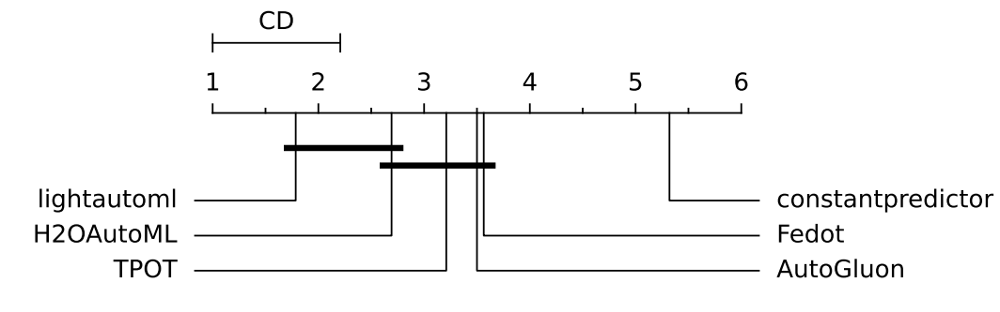
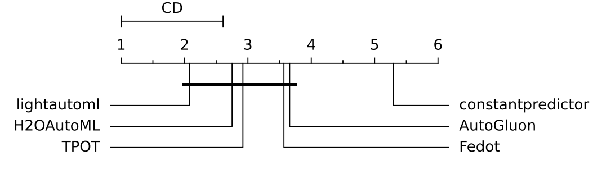
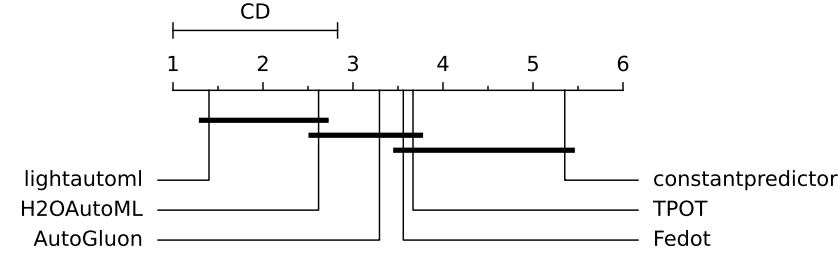
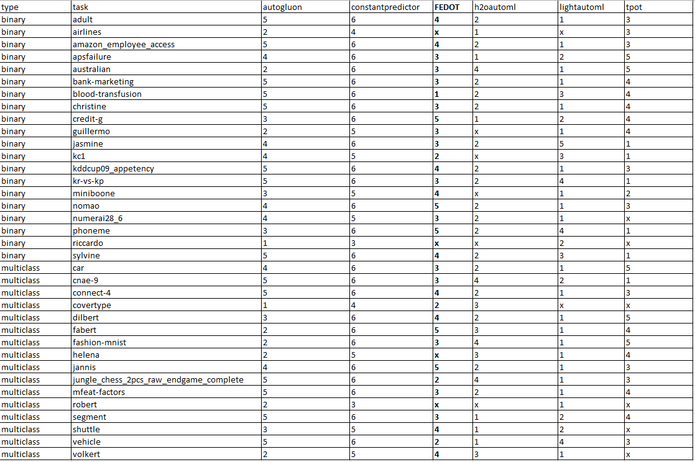
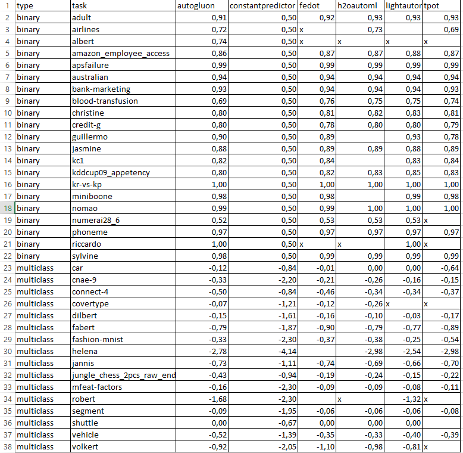

Tabular data
------------

We tested FEDOT on the results of `AMLB <https://github.com/openml/automlbenchmark>`_ benchmark.
We used the setup of the framework obtained from 'frameworks.yaml' on the date of starts of experiments.
So, the following stable versions were used: AutoGluon 0.7.0, TPOT 0.11.7, LightAutoML 0.3.7.3, v3.40.0.2, FEDOT 0.7.2.
Some runs for AutoGluon are failed due to the errors (described also in Appendix D of AMLB paper [1]).

The visualization obtained using built-in visualizations of critical difference plot (CD) from AutoMLBenchmark [1].

In a CD (Critical Difference) diagram,
we display each framework's average rank and highlight which ranks are
statistically significantly different from one another.

To determine the average rank per task,
we first replace any missing values with a constant predictor,
calculate ranks for represented AutoML solutions and constant predictor
for each dataset and than took an average value of ranks across all datasets for each represented solution.

We assess statistical significance of the rank differences using a non-parametric Friedman test with a
threshold of p < 0.05 (resulting in p ≈ 0 for all diagrams)
and apply a Nemenyi post-hoc test to identify which framework pairs differ significantly.

Time budget for all experiments is 1 hour, 10 folds are used (1h8c setup for ALMB). The results are
obtained using sever based on Xeon Cascadelake (2900MHz) with 12 cores and 16GB memory.

CD for all datasets (ROC AUC and negative log loss):

The CD diagram for all datasets (ROC AUC and negative log loss) shows that all AutoML frameworks
(LightAutoML, H2OAutoML, TPOT,  AutoGluon, FEDOT) perform statistically better than constant predictor:

CD for binary classification (ROC AUC):

The CD diagram for binary classification (ROC AUC) shows that all AutoML frameworks
(LightAutoML, H2OAutoML, TPOT,  AutoGluon, FEDOT) perform similarly,
falling within the same CD interval, and significantly outperform  the constant predictor:

CD for multiclass classification (negative logloss):

The CD diagram for multiclass classification (negative log loss) shows that
TPOT and Fedot demonstrate intermediate performance being on the border of the
CD interval with constant predictor and the CD interval with H2OAutoML:

We can conclude that FEDOT achieves performance comparable with competitors for tabular tasks.

The ranks for frameworks are provided below:

The raw metrics (ROC AUC for binary and logloss for multiclass) for frameworks are provided below:

The comparison with [1] shows that AutoGluon is underperforming in our hardware setup,
while TPOT and H2O are quite close in both setups.
To avoid any confusion, we provide below an additional comparison of the FEDOT metrics with the metrics from [1].
However, it should be noted that the conditions are different, as are the exact versions of the frameworks.

.. list-table:: AutoML Benchmark Results (AUC) with 10 Folds
   :header-rows: 1
   :widths: 20 6 6 6 6 6 6 6 6

   * - Task
     - FEDOT
     - H2O
     - TPOT
     - AutoGluon(B)
     - LightAutoML
     - GAMA(B)
     - MLJAR(P)
     - FLAML
   * - APSFailure
     - 0.989
     - **0.993**
     - 0.989
     - **0.993**
     - **0.993**
     - 0.990
     - 0.992
     - 0.992
   * - Airlines
     - 0.654
     - 0.731
     - 0.722
     - **0.732**
     - 0.727
     - 0.717
     - 0.730
     - 0.731
   * - Albert
     - 0.728
     - 0.761
     - 0.718
     - **0.782**
     - 0.780
     - 0.726
     - 0.765
     - 0.770
   * - Amazon_employee_access
     - 0.853
     - 0.877
     - 0.864
     - 0.902
     - 0.879
     - 0.867
     - **0.903**
     - 0.876
   * - Australian
     - 0.939
     - 0.935
     - 0.939
     - 0.941
     - **0.946**
     - 0.941
     - 0.944
     - 0.938
   * - KDDCup09_appetency
     - 0.753
     - 0.837
     - 0.831
     - 0.849
     - **0.851**
     - 0.818
     - 0.837
     - 0.825
   * - MiniBooNE
     - 0.981
     - 0.987
     - 0.982
     - **0.989**
     - 0.988
     - 0.982
     - 0.987
     - 0.987
   * - adult
     - 0.906
     - 0.931
     - 0.927
     - **0.932**
     - **0.932**
     - 0.929
     - 0.931
     - **0.932**
   * - bank-marketing
     - 0.929
     - 0.938
     - 0.935
     - **0.941**
     - 0.940
     - 0.936
     - 0.940
     - 0.937
   * - blood-transfusion
     - 0.759
     - **0.764**
     - 0.724
     - 0.758
     - 0.753
     - 0.753
     - 0.753
     - 0.730
   * - christine
     - 0.812
     - 0.825
     - 0.811
     - 0.826
     - **0.831**
     - 0.828
     - 0.823
     - 0.824
   * - credit-g
     - 0.778
     - 0.779
     - 0.791
     - **0.796**
     - **0.796**
     - 0.794
     - 0.785
     - 0.788
   * - guillermo
     - 0.891
     - 0.897
     - 0.826
     - 0.914
     - **0.932**
     - 0.865
     - 0.912
     - 0.919
   * - jasmine
     - 0.888
     - 0.887
     - 0.886
     - 0.886
     - 0.880
     - **0.891**
     - 0.886
     - 0.887
   * - kc1
     - 0.843
     - 0.829
     - 0.844
     - 0.840
     - 0.831
     - **0.852**
     - 0.824
     - 0.841
   * - kr-vs-kp
     - **1.000**
     - **1.000**
     - 0.999
     - **1.000**
     - **1.000**
     - **1.000**
     - **1.000**
     - 0.961
   * - nomao
     - 0.994
     - 0.996
     - 0.995
     - **0.997**
     - **0.997**
     - 0.995
     - **0.997**
     - **0.997**
   * - numerai28_6
     - 0.515
     - **0.531**
     - 0.528
     - **0.531**
     - **0.531**
     - 0.530
     - **0.531**
     - 0.528
   * - phoneme
     - 0.965
     - 0.968
     - 0.969
     - 0.969
     - 0.966
     - 0.971
     - 0.967
     - **0.972**
   * - riccardo
     - 0.998
     - **1.000**
     - 0.998
     - **1.000**
     - **1.000**
     - 0.999
     - **1.000**
     - **1.000**
   * - sylvine
     - 0.988
     - 0.990
     - 0.992
     - 0.990
     - 0.988
     - **0.993**
     - 0.992
     - 0.991
   * - vehicle
     - 0.354
     - 0.351
     - 0.417
     - 0.312
     - 0.389
     - 0.378
     - 0.349
     - **0.439**

.. list-table:: AutoML Benchmark Results (Logloss) with 10 Folds
   :header-rows: 1
   :widths: 20 6 6 6 6 6 6 6 6

   * - Task
     - FEDOT
     - H2O
     - TPOT
     - AutoGluon(B)
     - LightAutoML
     - GAMA(B)
     - MLJAR(P)
     - FLAML
   * - Covertype
     - 0.164
     - 0.253
     - 0.696
     - **0.057**
     - 0.082
     - 0.526
     - 0.105
     - 0.068
   * - Fashion-MNIST
     - 0.388
     - 0.283
     - 0.431
     - **0.221**
     - 0.248
     - 0.439
     - 0.259
     - 0.253
   * - Helena
     - 6.349
     - 2.791
     - 2.951
     - **2.467**
     - 2.555
     - 2.802
     - 2.653
     - 2.617
   * - Jannis
     - 0.787
     - 0.669
     - 0.734
     - **0.650**
     - 0.666
     - 0.732
     - 0.672
     - 0.674
   * - Robert
     - 1.745
     - 1.423
     - 1.956
     - 1.304
     - **1.283**
     - 1.710
     - 1.417
     - 1.382
   * - Shuttle
     - 0.001
     - **0.000**
     - 0.001
     - **0.000**
     - 0.001
     - 0.001
     - **0.000**
     - **0.000**
   * - Volkert
     - 1.040
     - 0.844
     - 1.013
     - **0.672**
     - 0.815
     - 1.102
     - 0.808
     - 0.795
   * - car
     - 0.011
     - **0.001**
     - 0.788
     - 0.002
     - **0.001**
     - 0.022
     - 0.010
     - 0.002
   * - cnae-9
     - 0.211
     - 0.200
     - 0.146
     - **0.126**
     - 0.152
     - **0.126**
     - 0.323
     - 0.164
   * - connect-4
     - 0.485
     - 0.311
     - 0.392
     - **0.295**
     - 0.335
     - 0.417
     - 0.342
     - 0.340
   * - dilbert
     - 0.159
     - 0.065
     - 0.150
     - **0.014**
     - 0.033
     - 0.176
     - 0.030
     - 0.024
   * - fabert
     - 0.859
     - 0.746
     - 0.886
     - **0.683**
     - 0.768
     - 0.763
     - 0.771
     - 0.766
   * - jungle_chess_2pcs_raw
     - 0.349
     - 0.136
     - 1.766
     - **0.012**
     - 0.145
     - 0.243
     - 0.198
     - 0.210
   * - mfeat-factors
     - 0.094
     - 0.096
     - 0.135
     - **0.071**
     - 0.080
     - 0.077
     - 0.096
     - 0.092
   * - segment
     - 0.062
     - 0.061
     - 0.075
     - **0.052**
     - 0.061
     - 0.067
     - 0.059
     - 0.067

[1] Gijsbers P. et al. AMLB: an AutoML benchmark //Journal of Machine Learning Research. – 2024. – Т. 25. – №. 101. – С. 1-65.

