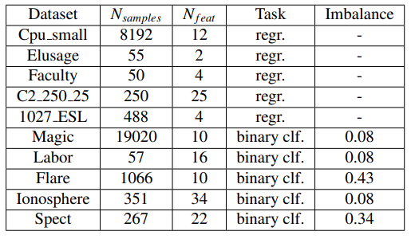
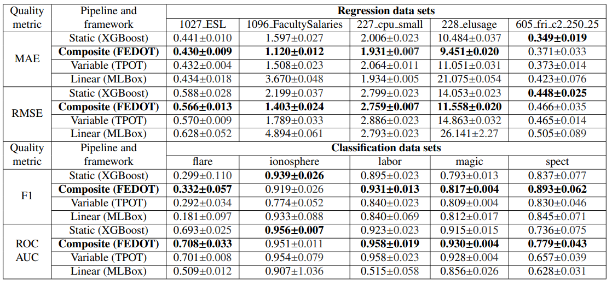
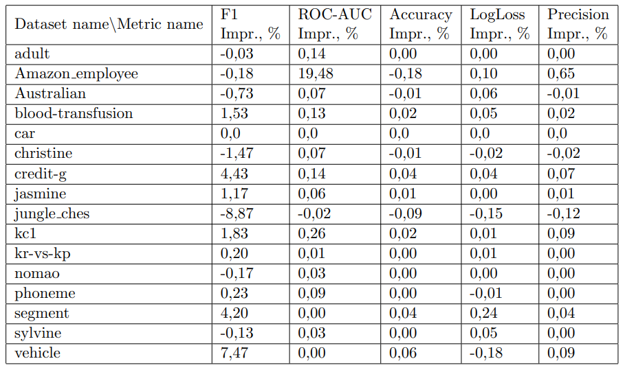

Tabular data
------------

The subset of PMLB benchmarks was evaluated for FEDOT, `TPOT <http://epistasislab.github.io/tpot/>`__, `MLBox <https://github.com/AxeldeRomblay/MLBox>`__ and XGboost baseline. The results and metadata are presented below.

|Metadata for datasets|

|Metrics for prediction|

As we can see from the table, the results obtained during the experiments demonstrate the advantage of composite pipelines created by the FEDOT over less sophisticated competitors. The only exception is a single case for regression and classification problems respectively, where the maximum value of the quality metric was obtained using a static pipeline.

Also, the comparison was conducted against the state-of-the-art AutoGluon framework.

|Comparison of FEDOT and AutoGluon|

There is a small advantage of the FEDOT for F1 and ROC AUC metrics, but the other metrics are near equal.

There are even more overall classification problem results across popular AutoML frameworks: 

.. csv-table:: Classification statistics
   :file: amlb_res.csv
   :align: center
   :widths: auto
   :header-rows: 1
