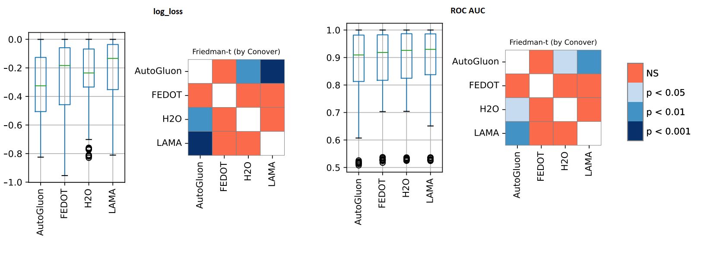

Tabular data
------------

Here are overall classification problem results across state-of-the-art AutoML frameworks
using `AMLB <https://github.com/openml/automlbenchmark>`__ test suite:

.. csv-table::
   :header: Dataset, Metric, AutoGluon, FEDOT, H2O, TPOT

   adult, auc, 0.91001, 0.91529, **0.93077**, 0.92729
   airlines, auc, 0.72491, 0.65378, **0.73039**, 0.69368
   albert, auc, **0.73903**, 0.72765, nan, nan
   amazon_employee_access, auc, 0.85715, 0.85911, **0.87281**, 0.86625
   apsfailure, auc, 0.99062, 0.98999, **0.99252**, 0.99044
   australian, auc, **0.93953**, 0.93785, 0.93857, 0.93604
   bank-marketing, auc, 0.93126, 0.93245, **0.93860**, 0.93461
   blood-transfusion, auc, 0.68959, 0.72444, **0.75949**, 0.74019
   christine, auc, 0.80429, 0.80446, **0.81936**, 0.80669
   credit-g, auc, **0.79529**, 0.78458, 0.79357, 0.79381
   guillermo, auc, **0.89967**, 0.89125, nan, 0.78331
   jasmine, auc, 0.88312, 0.88548, 0.88734, **0.89038**
   kc1, auc, 0.82226, 0.83857, nan, **0.84481**
   kddcup09_appetency, auc, 0.80447, 0.78778, **0.82912**, 0.82556
   kr-vs-kp, auc, 0.99886, 0.99925, 0.99972, **0.99976**
   miniboone, auc, 0.98217, 0.98102, nan, **0.98346**
   nomao, auc, 0.99483, 0.99420, **0.99600**, 0.99538
   numerai28_6, auc, 0.51655, 0.52161, **0.53052**, nan
   phoneme, auc, 0.96542, 0.96448, 0.96751, **0.97070**
   riccardo, auc, **0.99970**, 0.99794, nan, nan
   sylvine, auc, 0.98470, 0.98496, 0.98936, **0.99339**
   car, neg_logloss, -0.11659, -0.08885, **-0.00347**, -0.64257
   cnae-9, neg_logloss, -0.33208, -0.27010, -0.21849, **-0.15369**
   connect-4, neg_logloss, -0.50157, -0.47033, **-0.33770**, -0.37349
   covertype, neg_logloss, **-0.07140**, -0.14096, -0.26422, nan
   dilbert, neg_logloss, -0.14967, -0.24455, **-0.07643**, -0.16839
   dionis, neg_logloss, **-2.15760**, nan, nan, nan
   fabert, neg_logloss, -0.78781, -0.90152, **-0.77194**, -0.89159
   fashion-mnist, neg_logloss, **-0.33257**, -0.38379, -0.38328, -0.53549
   helena, neg_logloss, **-2.78497**, -6.34863, -2.98020, -2.98157
   jannis, neg_logloss, -0.72838, -0.76192, **-0.69123**, -0.70310
   jungle_chess, neg_logloss, -0.43064, -0.27074, -0.23952, **-0.21872**
   mfeat-factors, neg_logloss, -0.16118, -0.17412, **-0.09296**, -0.10726
   robert, neg_logloss, **-1.68431**, -1.74509, nan, nan
   segment, neg_logloss, -0.09419, -0.09643, **-0.05962**, -0.07711
   shuttle, neg_logloss, -0.00081, -0.00101, **-0.00036**, nan
   vehicle, neg_logloss, -0.51546, -0.42776, **-0.33137**, -0.39150
   volkert, neg_logloss, **-0.92007**, -1.04485, -0.97797, nan

The statistical analysis was conducted using the Friedman t-test.
The results of experiments and analysis confirm that FEDOT results are statistically indistinguishable
from SOTA competitors H2O, AutoGluon and TPOT (see below).

