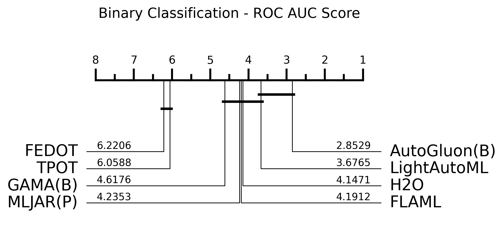
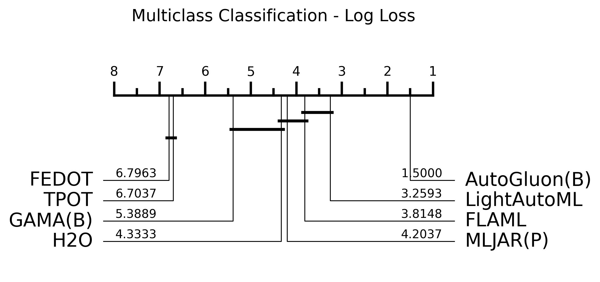
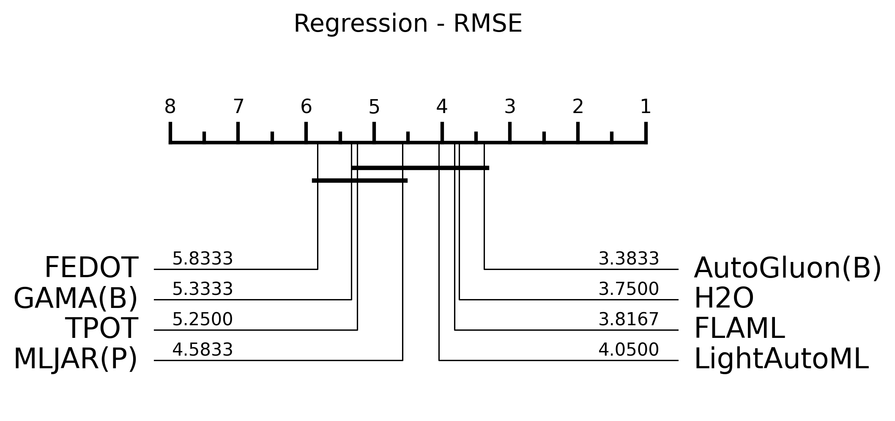

Tabular data
------------

We tested FEDOT on the results of `AMLB <https://github.com/openml/automlbenchmark>`_ benchmark.
We used the setup of the framework obtained from 'frameworks.yaml' on the date of starts of experiments.
So, the following stable versions were used: AutoGluon 0.7.0, TPOT 0.11.7, LightAutoML 0.3.7.3, v3.40.0.2, FEDOT 0.7.2.
Some runs for AutoGluon are failed due to the errors (described also in Appendix D of AMLB paper [1]).

The visualization obtained using built-in visualizations of critical difference plot (CD) from AutoMLBenchmark [1].

In a CD (Critical Difference) diagram,
we display each framework's average rank and highlight which ranks are
statistically significantly different from one another.

To determine the average rank per task,
we first replace any missing values with a constant predictor,
calculate ranks for represented AutoML solutions and constant predictor
for each dataset and than took an average value of ranks across all datasets for each represented solution.

We assess statistical significance of the rank differences using a non-parametric Friedman test with a
threshold of p < 0.05 (resulting in p ≈ 0 for all diagrams)
and apply a Nemenyi post-hoc test to identify which framework pairs differ significantly.

Time budget for all experiments is 1 hour, 10 folds are used (1h8c setup for ALMB). The results are
obtained using sever based on Xeon Cascadelake (2900MHz) with 12 cores and 16GB memory.

CD for binary classification (ROC AUC):

The CD diagram for binary classification (ROC AUC) shows that all AutoML frameworks
(LightAutoML, H2OAutoML, TPOT,  AutoGluon, FEDOT) perform similarly,
falling within the same CD interval, and significantly outperform  the constant predictor:

CD for multiclass classification (negative logloss):

The CD diagram for multiclass classification (negative log loss) shows that
TPOT and Fedot demonstrate intermediate performance being on the border of the
CD interval with constant predictor and the CD interval with H2OAutoML:

We can conclude that FEDOT achieves performance comparable with competitors for tabular tasks.

The comparison with [1] shows that AutoGluon is underperforming in our hardware setup,
while TPOT and H2O are quite close in both setups.
To avoid any confusion, we provide below an additional comparison of the FEDOT metrics with the metrics from [1].
However, it should be noted that the conditions are different, as are the exact versions of the frameworks.

CD for regression (RMSE):

The CD diagram for regression (RMSE) shows the relative performance of all AutoML frameworks
on regression tasks, where lower RMSE values indicate better performance.

AMLB Paper Comparison
---------------------

This section provides a comprehensive comparison of FEDOT with other AutoML frameworks from the AMLB paper [1].
The tables below include all datasets from the AMLB benchmark suite, with results for FEDOT where available.

Binary Classification (ROC AUC)
~~~~~~~~~~~~~~~~~~~~~~~~~~~~~~~~

.. csv-table:: AMLB Binary Classification Results (AUC)
   :header-rows: 1
   :widths: 20,6,6,6,6,6,6,6,6

   Task, FEDOT, H2O, TPOT, AutoGluon(B), LightAutoML, GAMA(B), MLJAR(P), FLAML
   ada, 0.914, 0.921, 0.917, 0.921, 0.921, 0.920, 0.921, 0.924
   adult, 0.929, 0.931, 0.927, 0.932, 0.932, 0.929, 0.931, 0.932
   airlines, 0.716, 0.731, 0.722, 0.732, 0.727, 0.717, 0.730, 0.731
   albert, 0.749, 0.761, 0.718, 0.782, 0.780, 0.726, 0.765, 0.770
   amazon-commerce-reviews, -, -, -, -, -, -, -, -
   Amazon_employee_access, 0.863, 0.877, 0.864, 0.902, 0.879, 0.867, 0.903, 0.876
   APSFailure, 0.992, 0.993, 0.989, 0.993, 0.993, 0.990, 0.992, 0.992
   arcene, 0.869, 0.839, 0.831, 0.873, 0.848, 0.878, -, 0.868
   Australian, 0.939, 0.935, 0.939, 0.941, 0.946, 0.941, 0.944, 0.938
   bank-marketing, 0.936, 0.938, 0.935, 0.941, 0.940, 0.936, 0.940, 0.937
   Bioresponse, 0.878, 0.887, 0.880, 0.886, 0.884, 0.884, 0.883, 0.884
   blood-transfusion-service-center, 0.759, 0.764, 0.724, 0.758, 0.753, 0.753, 0.753, 0.730
   christine, 0.817, 0.825, 0.811, 0.826, 0.831, 0.828, 0.823, 0.824
   churn, 0.739, 0.925, 0.919, 0.924, 0.926, 0.920, 0.925, 0.922
   Click_prediction_small, 0.713, 0.701, 0.715, 0.710, 0.728, 0.655, 0.709, 0.723
   credit-g, 0.778, 0.779, 0.791, 0.796, 0.796, 0.794, 0.785, 0.788
   Diabetes130US, -, -, -, -, -, -, -, -
   dionis, -, -, -, -, -, -, -, -
   eucalyptus, -, -, -, -, -, -, -, -
   gina, 0.988, 0.991, 0.988, 0.992, 0.990, 0.991, 0.990, 0.992
   guillermo, 0.891, 0.897, 0.826, 0.914, 0.932, 0.865, 0.912, 0.919
   Higgs, -, 0.832, 0.737, 0.838, 0.838, 0.784, -, 0.839
   Internet-Advertisements, 0.984, 0.986, 0.981, 0.986, 0.986, 0.983, 0.977, 0.987
   jasmine, 0.888, 0.887, 0.886, 0.886, 0.880, 0.891, 0.886, 0.887
   kc1, 0.843, 0.829, 0.844, 0.840, 0.831, 0.852, 0.824, 0.841
   KDDCup09-Upselling, -, -, -, -, -, -, -, -
   KDDCup09_appetency, 0.753, 0.837, 0.831, 0.849, 0.851, 0.818, 0.837, 0.825
   KDDCup99, -, -, -, -, -, -, -, -
   kick, -, 0.789, 0.728, 0.791, 0.785, 0.791, 0.751, 0.787
   kr-vs-kp, 1.000, 1.000, 0.999, 1.000, 1.000, 1.000, 1.000, 0.961
   madeline, 0.943, 0.943, 0.948, 0.945, 0.935, 0.957, 0.950, 0.954
   micro-mass, -, -, -, -, -, -, -, -
   MiniBooNE, 0.981, 0.987, 0.982, 0.989, 0.988, 0.982, 0.987, 0.987
   nomao, 0.994, 0.996, 0.995, 0.997, 0.997, 0.995, 0.997, 0.997
   numerai28.6, 0.531, 0.531, 0.528, 0.531, 0.531, 0.530, 0.531, 0.528
   okcupid-stem, -, -, -, -, -, -, -, -
   ozone-level-8hr, 0.915, 0.930, 0.928, 0.933, 0.930, 0.925, 0.929, 0.922
   pc4, -, 0.948, 0.944, 0.952, 0.950, 0.950, 0.953, 0.950
   philippine, 0.868, 0.882, 0.879, 0.878, 0.866, 0.892, 0.872, 0.891
   PhishingWebsites, 0.782, 0.998, 0.997, 0.998, 0.998, 0.997, 0.998, 0.998
   phoneme, 0.965, 0.968, 0.969, 0.969, 0.966, 0.971, 0.967, 0.972
   porto-seguro, -, 0.642, 0.577, 0.643, 0.641, 0.624, 0.643, 0.642
   qsar-biodeg, 0.939, 0.939, 0.926, 0.942, 0.934, 0.936, 0.937, 0.930
   riccardo, 0.998, 1.000, 0.998, 1.000, 1.000, 0.999, 1.000, 1.000
   Satellite, 0.992, 0.979, 0.984, 0.996, 0.986, 0.996, 0.993, 0.978
   sf-police-incidents, -, 0.688, 0.615, 0.697, 0.685, 0.623, 0.694, 0.709
   steel-plates-fault, -, -, -, -, -, -, -, -
   sylvine, 0.988, 0.990, 0.992, 0.990, 0.988, 0.993, 0.992, 0.991
   wilt, 0.990, 0.992, 0.996, 0.995, 0.994, 0.996, 0.995, 0.991

Multiclass Classification (LogLoss)
~~~~~~~~~~~~~~~~~~~~~~~~~~~~~~~~~~~~

.. csv-table:: AMLB Multiclass Classification Results (LogLoss)
   :header-rows: 1
   :widths: 20,6,6,6,6,6,6,6,6

   Task, FEDOT, H2O, TPOT, AutoGluon(B), LightAutoML, GAMA(B), MLJAR(P), FLAML
   car, 0.011, 0.001, 0.788, 0.002, 0.001, 0.022, 0.010, 0.002
   cmc, 0.983, 0.902, 0.901, 0.927, 0.886, 0.897, 0.883, 0.904
   cnae-9, 0.211, 0.200, 0.146, 0.126, 0.152, 0.126, 0.323, 0.164
   connect-4, 0.404, 0.311, 0.392, 0.295, 0.335, 0.417, 0.342, 0.340
   covertype, 0.164, 0.253, 0.696, 0.057, 0.082, 0.526, 0.105, 0.068
   Diabetes130US, 0.838, 0.833, 0.846, 0.831, 0.810, 0.847, 0.831, 0.831
   dilbert, 0.040, 0.065, 0.150, 0.014, 0.033, 0.176, 0.030, 0.024
   dna, 0.122, 0.108, 0.112, 0.106, 0.109, 0.107, 0.119, 0.108
   eucalyptus, 0.755, 0.666, 0.712, 0.654, 0.684, 0.701, 0.677, 0.726
   fabert, 0.859, 0.746, 0.886, 0.683, 0.768, 0.763, 0.771, 0.766
   Fashion-MNIST, 0.388, 0.283, 0.431, 0.221, 0.248, 0.439, 0.259, 0.253
   first-order-theorem-proving, 1.109, 1.075, 1.081, 1.039, 1.046, 1.057, 1.046, 1.041
   GesturePhaseSegmentationProcessed, 0.846, 0.702, 0.870, 0.668, 0.761, 0.848, 0.788, 0.769
   helena, 2.963, 2.791, 2.951, 2.467, 2.555, 2.802, 2.653, 2.617
   jannis, 0.753, 0.669, 0.734, 0.650, 0.666, 0.732, 0.672, 0.674
   jungle_chess_2pcs_raw_endgame_complete, 0.349, 0.136, 1.766, 0.012, 0.145, 0.243, 0.198, 0.210
   mfeat-factors, 0.089, 0.096, 0.135, 0.071, 0.080, 0.077, 0.096, 0.092
   micro-mass, 0.523, 0.400, 0.345, 0.211, 0.280, 0.226, 0.383, 0.309
   okcupid-stem, 0.614, 0.571, 0.571, 0.559, 0.560, 0.570, 0.565, 0.562
   robert, 1.745, 1.423, 1.956, 1.304, 1.283, 1.710, 1.417, 1.382
   segment, 0.062, 0.061, 0.075, 0.052, 0.061, 0.067, 0.059, 0.067
   shuttle, 0.001, 0.000, 0.001, 0.000, 0.001, 0.001, 0.000, 0.000
   steel-plates-fault, 0.538, 0.490, 0.509, 0.464, 0.478, 0.491, 0.484, 0.482
   vehicle, 0.354, 0.351, 0.417, 0.312, 0.389, 0.378, 0.349, 0.439
   volkert, 1.040, 0.844, 1.013, 0.672, 0.815, 1.102, 0.808, 0.795
   wine-quality-white, 0.972, 0.782, 0.792, 0.698, 0.786, 0.766, 0.806, 0.727
   yeast, 1.131, 1.061, 1.056, 1.003, 1.040, 1.042, 1.013, 1.004

Regression (RMSE)
~~~~~~~~~~~~~~~~~

.. csv-table:: AMLB Regression Results (RMSE)
   :header-rows: 1
   :widths: 20,6,6,6,6,6,6,6,6

   Task, FEDOT, H2O, TPOT, AutoGluon(B), LightAutoML, GAMA(B), MLJAR(P), FLAML
   abalone, 2.10, 2.10, 2.10, 2.10, 2.10, 2.10, 2.10, 2.10
   Airlines_DepDelay_10M, -, 29.00, 29.00, 29.00, 29.00, 29.00, -, 29.00
   Allstate_Claims_Severity, 2.0e+03, 1.9e+03, 2.1e+03, 1.9e+03, 1.9e+03, 2.0e+03, 1.9e+03, 1.9e+03
   black_friday, 3.5e+03, 3.4e+03, 3.5e+03, 3.5e+03, 3.4e+03, 3.5e+03, 3.4e+03, 3.4e+03
   boston, 3.27, 2.90, 3.10, 2.90, 2.90, 3.00, 2.90, 2.90
   Brazilian_houses, 3.85, 3.2e+02, 3.90, 2.3e+04, 3.80, 4.30, 2.5e+13, 1.3e+03
   Buzzinsocialmedia_Twitter, 152.74, 150.00, 170.00, 150.00, 160.00, 160.00, 170.00, 150.00
   colleges, 0.15, 0.14, 0.14, 0.14, 0.14, 0.15, 0.14, 0.14
   diamonds, 549.71, 520.00, 530.00, 530.00, 520.00, 530.00, 510.00, 520.00
   elevators, 0.01, 0.002, 0.002, 0.002, 0.002, 0.002, 0.002, 0.002
   house_16H, 3.1e+04, 2.9e+04, 3.1e+04, 2.8e+04, 2.9e+04, 3.0e+04, 2.9e+04, 2.9e+04
   house_prices_nominal, 3.2e+04, 2.7e+04, 2.7e+04, 2.6e+04, 2.6e+04, 2.7e+04, 2.5e+04, 2.6e+04
   house_sales, 1.3e+05, 1.1e+05, 1.2e+05, 1.1e+05, 1.1e+05, 1.2e+05, 1.1e+05, 1.1e+05
   Mercedes_Benz_Greener_Manufacturing, 8.41, 8.30, 8.30, 8.60, 8.30, 8.30, 8.30, 8.30
   MIP-2016-regression, 2.2e+04, 2.1e+04, 2.2e+04, 2.1e+04, 2.2e+04, 2.2e+04, 2.2e+04, 2.2e+04
   Moneyball, 21.05, 21.00, 21.00, 21.00, 21.00, 2.0e+10, 21.00, 22.00
   nyc-taxi-green-dec-2016, 1.69, 1.70, 1.90, 1.50, 1.70, 1.80, 1.70, 1.60
   OnlineNewsPopularity, 1.1e+04, 1.2e+04, 1.1e+04, 1.4e+04, 1.1e+04, 1.1e+04, 1.5e+04, 1.1e+04
   pol, 4.22, 2.90, 4.00, 2.60, 3.90, 4.10, 2.40, 3.90
   QSAR-TID-10980, 0.72, 0.73, 0.75, 0.71, 0.72, 0.76, -, 0.73
   QSAR-TID-11, 0.76, 0.69, 0.72, 0.69, 0.69, 0.72, 0.72, 0.69
   quake, 0.19, 0.19, 0.19, 0.19, 0.19, 0.19, 0.19, 0.19
   Santander_transaction_value, -, 7.0e+06, 7.0e+06, 6.8e+06, 6.9e+06, 7.0e+06, 6.9e+06, 7.0e+06
   SAT11-HAND-runtime-regression, 1.0e+03, 9.3e+02, 1.1e+03, 8.9e+02, 1.2e+03, 1.2e+03, 1.2e+03, 1.0e+03
   sensory, 0.84, 0.69, 0.68, 0.67, 0.68, 0.68, 0.68, 0.68
   socmob, 14.51, 15.00, 18.00, 13.00, 20.00, 15.00, 21.00, 14.00
   space_ga, 0.10, 0.097, 0.10, 0.095, 0.10, 0.097, 0.10, 0.10
   tecator, 0.78, 0.82, 0.67, 0.84, 0.80, 0.89, 1.00, 0.93
   topo_2_1, 0.028, 0.028, 0.028, 0.028, 0.028, 0.028, 0.028, 0.028
   us_crime, 0.131, 0.13, 0.13, 0.13, 0.13, 0.13, 0.13, 0.13
   wine_quality, 0.584, 0.57, 0.58, 0.57, 0.59, 0.57, 0.59, 0.57
   Yolanda, 9.196, 8.80, 9.60, 8.40, 8.60, 9.40, 8.60, 8.60
   yprop_4_1, 0.028, 0.028, 0.028, 0.028, 0.028, 0.028, 0.028, 0.028

[1] Gijsbers P. et al. AMLB: an AutoML benchmark //Journal of Machine Learning Research. – 2024. – Т. 25. – №. 101. – С. 1-65.
