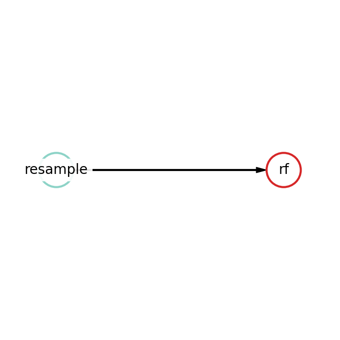

Classification example
==============================================

This example explains how to solve classification task using Fedot.

Generally Fedot provides a high-level API that enables you to use common fit/predict interface. To use API it is required
to import certain object:

.. code-block:: python

    from fedot import Fedot

Then we have to load data. In Fedot you can do it by providing path to csv format data files.

.. code-block:: python

    train_data_path = 'path_to_train_file'
    test_data_path = 'path_to_test_file'

Initialize the FEDOT object and define the type of modeling problem. In this case, problem is ``classification``.
You also can define metric parameter (ROC-AUC in this example), timeout in minutes (in this example we limit fedot for 5 minutes).

.. code-block:: python

    model = Fedot(problem='classification', metric='roc_auc', timeout=5)

.. note::

    Class ``Fedot.__init__()`` has more, e.g.
    ``n_jobs`` for parallelization. For more details, see the :doc:`FEDOT API </api/api>` section in our documentation.

To train our model we should call method ``fit()``. You need to provide table with features and target in ``features``
and pass name of target column in ``target`` field. This method returns the best pipeline was obtained during optimization.

.. code-block:: python

    best_pipeline = model.fit(features=train, target='target')

After the fitting is completed, you can look at the structure of the resulting pipeline.
For example, let best pipeline consist of two nodes: resampling operation (*resample*) and Random Forest (*rf*).
Let see how it looks like.

In text format:

.. code-block:: python

    best_pipeline.print_structure()

.. code-block:: text

    Pipeline structure:
    {'depth': 2, 'length': 2, 'nodes': [rf, resample]}
    rf - {'n_jobs': -1, 'bootstrap': False, 'criterion': 'entropy', 'max_features': 0.2452946642710205, 'min_samples_leaf': 6, 'min_samples_split': 4, 'n_estimators': 100}
    resample - {'balance': 'expand_minority', 'replace': False, 'balance_ratio': 0.5984630982827773}

And in plot format:

.. code-block:: python

    best_pipeline.show()

|pipeline_structure|

To obtain prediction for test data you need call ``predict()`` or ``predict_proba()`` method from ``Fedot`` class.
Since we want to calculate ROC-AUC metric for our test data we should use ``predict_proba()`` method.

.. code-block:: python

    prediction = model.predict_proba(features=test_data_path)

    if visualization:
        auto_model.plot_prediction()

.. hint::

    If you want to predict target labels use ``predict()`` method.

The ``get_metrics()`` method estimates the quality of predictions according the selected metrics.

.. code-block:: python

     print(auto_model.get_metrics(rounding_order=4))  # we can control the rounding of metrics

.. note::

   You may see, that get_metrics() returned not only ROC-AUC metric. You can pass names of interested metrics by
   metrics_name parameter. F.e. ``get_metrics(metric_names=['roc-auc', 'f1'])``.

Since you got a prediction and calculated metrics you can plot your prediction by calling ``plot_prediction()`` method.
For classification task it plots ROC curve.
.. code-block:: python

     model.plot_prediction()

You may interested to save the model. To perform that just call ``best_pipeline.save()``

.. code-block:: python

     pipeline.save(path='path_to_save_and_load', create_subdir=False, is_datetime_in_path=False)

To load fitted pipeline you can invoke ``.load()`` from just initialised ``Pipeline`` object method with passing path to your pipeline.

.. code-block:: python

     from fedot.core.pipelines.pipeline import Pipeline
     loaded_pipeline = Pipeline().load('path_to_save_and_load')

And you can do inference:

.. code-block:: python
     import pandas as pd
     from fedot.core.repository.dataset_types import DataTypesEnum
     from fedot.core.repository.tasks import Task, TaskTypesEnum
     new_features = pd.read_csv('new_data.csv')
     new_data_to_predict = InputData(features=new_features.values,
                                     target=None,  # if you don't know your target
                                     idx=new_features.index.values,
                                     task=Task(TaskTypesEnum.classification),
                                     data_type=DataTypesEnum.table)
     prediction = loaded_pipeline.predict(new_data_to_predict).predict # Note that we should take .predict field for prediction
.. note::

    ``Pipeline`` don't have method ``predict_proba()``, you need to use param
    output_mode: desired form of output for operations

            .. details:: possible ``output_mode`` options:

                - ``default`` -> (as is, default)
                - ``labels`` -> (numbers of classes - for classification)
                - ``probs`` -> (probabilities - for classification == default)
                - ``full_probs`` -> (return all probabilities - for binary classification)

Thus by this example we learned how to solve classification task with Fedot.

