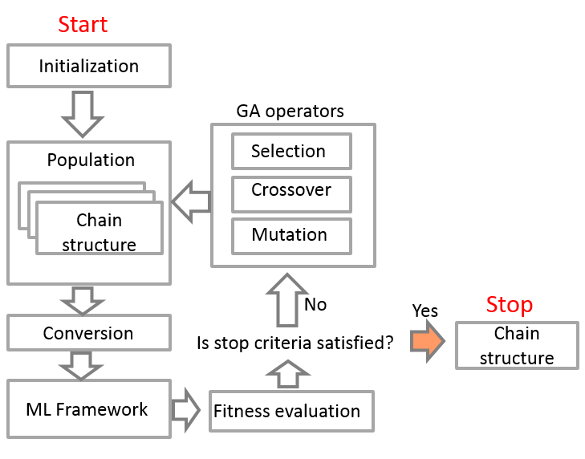

Algorithms
==========

Description of the algorithm for creation of machine learning models’ chains

Purpose of the algorithm
------------------------

Creation of a chain of machine learning (ML) models to solve application
tasks. For each problem to be solved, the modified genetic programming
algorithm forms a chain of several ML models contained in a given set. A
chain can contain two types of nodes:

1. Secondary nodes. Nodes that combine multiple models (input
   characteristics are generated from model predictions merged by this
   node)

2. Primary nodes. The nodes, representing independent models (model of
   the first level which input features are obtained from solving task)

The data transfer between nodes can be represented as follows:

Input data
----------

1. Algorithm resources (composer_requirements)
~~~~~~~~~~~~~~~~~~~~~~~~~~~~~~~~~~~~~~~~~~~~~~

-  primary и secondary - two sets of models that can be used as Primary
   nodes and Secondary nodes, respectively, taken from the generated
   model repository.
-  num_of_generations - a number of generations of the evolutionary
   algorithm.
-  pop_size - the size of trees population.
-  max_depth - maximum depth of a tree.
-  max_arity - maximum arity of a Secondary node (maximum amount of
   models, which can be merged by a node).
-  crossover_prob - breeding probability in a generic algorithm.
-  mutation_prob - mutation probability in a generic algorithm.

2. Database of the solving task.
~~~~~~~~~~~~~~~~~~~~~~~~~~~~~~~~

3. A quality metric for a task solution (taken from an existing quality metrics repository quality_metrics_repository.py).
~~~~~~~~~~~~~~~~~~~~~~~~~~~~~~~~~~~~~~~~~~~~~~~~~~~~~~~~~~~~~~~~~~~~~~~~~~~~~~~~~~~~~~~~~~~~~~~~~~~~~~~~~~~~~~~~~~~~~~~~~~

As an example, if you want to apply the ROC-AUCs quality metric to the
algorithm, you need to initialize it as follows:

.. code:: python

   metric_function = MetricsRepository().metric_by_id(ClassificationMetricsEnum.ROCAUC)

Output data
-----------

The output is the ML-model tree found by an evolutionary algorithm and
converted using \_tree_to_chain method into the ML-model chain. ##
Description of the operation principle Solutions in genetic programming
are presented as trees. The trees may be n-ary, i.e. the number of
under-nodes of each tree node may not be greater than n. Usually, in
genetic programming, tree nodes are elements of one of two sets:
terminal (T) or functional (F). A functional set includes functions that
are used to form a solution and a terminal set includes constants and
variables. Within this framework, the equivalent of the function nodes
is Secondary nodes, and Primary nodes stand for terminal ones. ### Let’s
have a look at the detailed description of the algorithm: The evolution
process according to which the genetic programming algorithm is
functioning can be described as follows: a population of several chains
is accidentally initialized, and then covers the best regions of the
search space through tree selection, mutation, and recombination random
processes. Scheme of the genetic programming algorithm for model
chaining:

