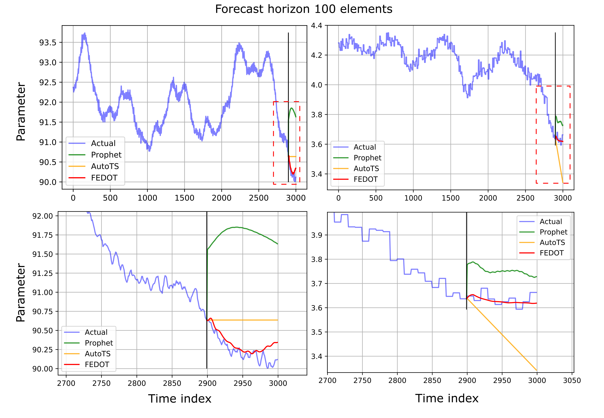
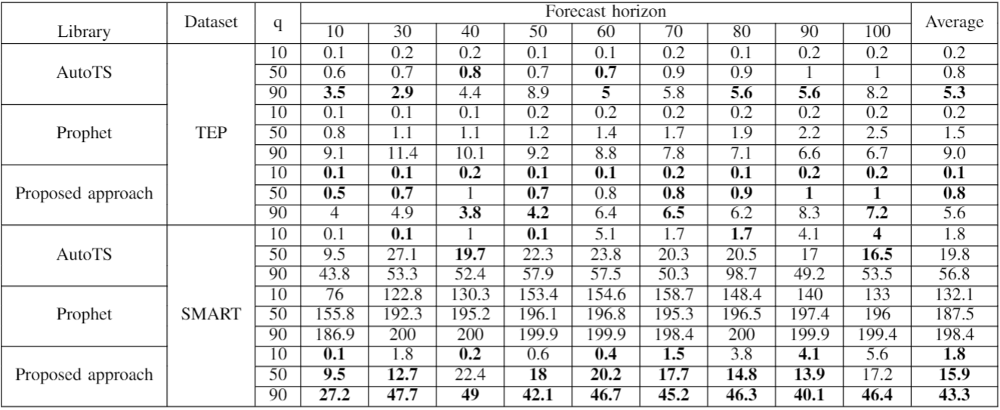

Time series forecasting
-----------------------

With FEDOT it is possible to effectively forecast time series. In our research papers, we make detailed comparisons on various datasets with other libraries. Below are some results of such comparisons.

|Forecast examples|

Example forecasts for some time series compared to forecasting libraries such as `AutoTS <https://github.com/winedarksea/AutoTS>`__ and `Prophet <https://github.com/facebook/prophet>`__.

We used two datasets with TEP and SMART time series, on which we measured prediction error. The total number of time series is 71. The metric for estimation is Symmetric Mean Absolute Percentage Error (SMAPE).

|Time series SMAPE|

The results of comparison with competing libraries averaged for all time series in each dataset by SMAPE. The errors are provided for different forecast horizons and shown by quantiles (q) as 10th, 50th (median) and 90th. The smallest error values on the quantile are shown in bold.

