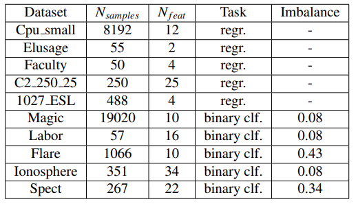
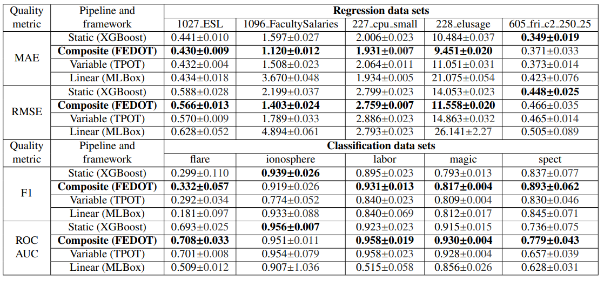

Tabular data
------------

The subset of PMLB benchmarks were evaluated for FEDOT, `TPOT <http://epistasislab.github.io/tpot/>`__, `MLBox <https://github.com/AxeldeRomblay/MLBox>`__ and XGboost baseline. The results and metadata are presented below.

|Metadata for datasets|

|Metrics for prediction|

As we can see from the table, the results obtained during the
experiments demonstrate the advantage of composite pipeline
created by the proposed approach over competitors. The only
exception is a single case for regression and classification problems respectively, where the maximum value of the quality metric was obtained using a static pipeline.

