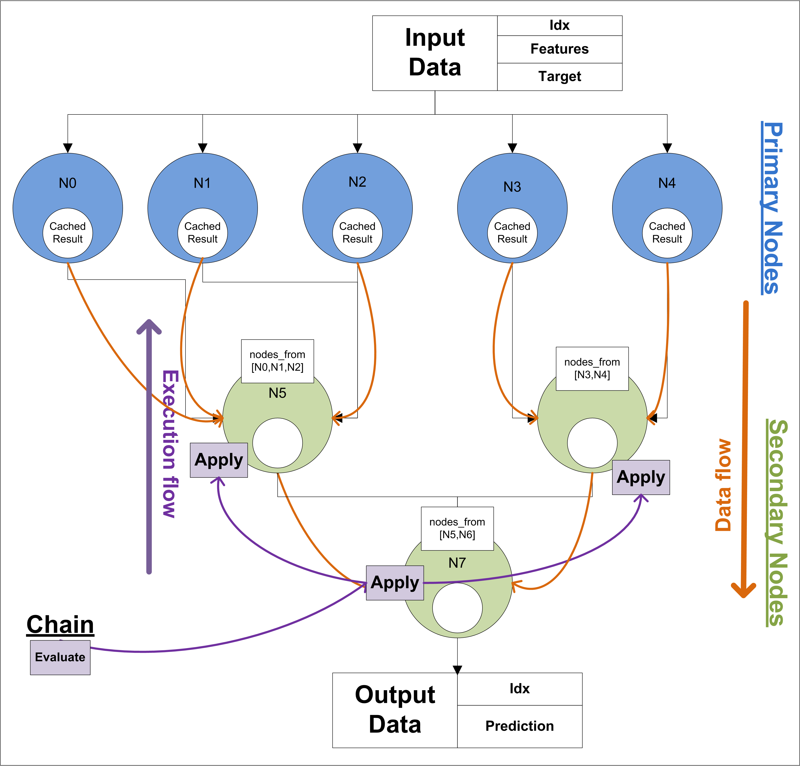

FEDOT.Ideas
===========

What ideas are implemented in the framework FEDOT?

-  ML and AutoML should be more “omnivorous.” The FEDOT framework will
   allow to create mathematical models for solving subject problems with
   the possibility to attract additional specific knowledge (for
   example, in the form of custom models or simulation of expert logic
   in model construction).
-  The AutoML should be simpler and more flexible to manage. FEDOT
   framework enables flexible integration of user-friendly ML task
   management solutions, as well as the use of a constantly replenished
   repository of model workpieces and generative algorithms for growing
   solutions, which greatly simplifies its use.
-  The ML must be reproducible. The FEDOT framework will allow you to
   keep a detailed description of the model configurations and learning
   process, as well as the model itself, making the results
   reproducible.

Framework structure
-------------------

A framework kernel configured for different task classes, such as: \*
predictions modeling; \* creation of system dynamics models; \*
imitating modeling; A library with independent implementations of
intelligent composite algorithms to identify data-driven models with
different requirements to structure and data; Alienated composite models
(model chains) for solving specific domain problems (socio-financial,
metocean, physical, etc.)

The Fedot can solve following classes of problems:
--------------------------------------------------

1. Label new objects based on existing reference labels for other
   objects (classification)
2. Estimate object characteristic’ values based on known characteristic
   values for other objects (regression)
3. Predict future behavior of the object based on historical data
   (forecasting)
4. Split objects into several significant groups (clustering)
5. Create new synthetic objects that reproduce the characteristics and
   behavior of the real (synthetic data generation)
6. Interpret an existing model by building a new, well interpreted model
   on its input and output data (interpretation)
7. Improve the quality of modeling for an existing model (hybrid
   modelling)
8. Build a model that approximates an unknown time-spatial function by
   data (surrogate modelling).

Main advantages
---------------

-  A high-level task description language that allows you to configure
   the framework very flexibly;
-  Possibility to obtain models with specified quality, complexity,
   interpretability (including for multicriteria cases);
-  Ability to get any-time result;
-  Ability to suspend and resume model identification;
-  The ability to integrate many popular Python open source solutions
   for AutoML/MetaLearning, optimization, quality evaluation, etc.;
-  Reuse of created models by the user or other users;

Data and execution flow
-----------------------

