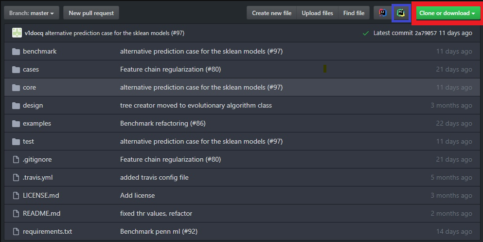
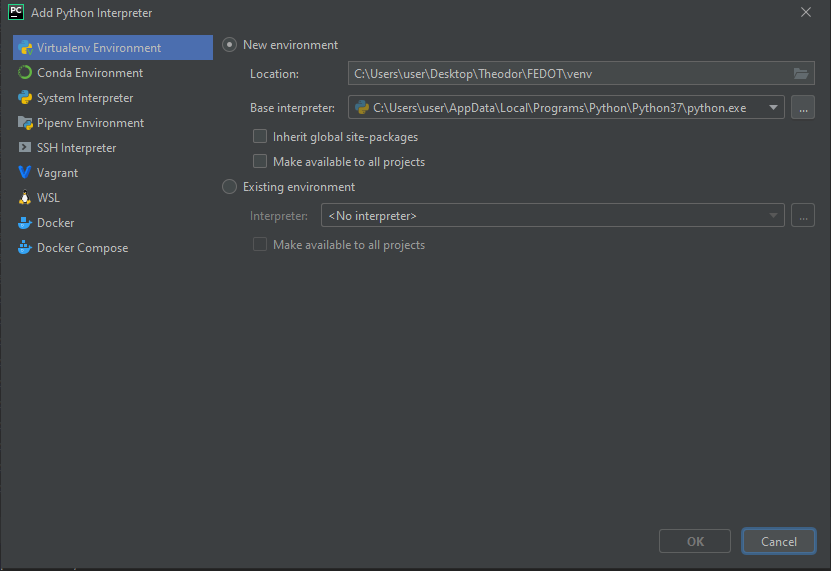
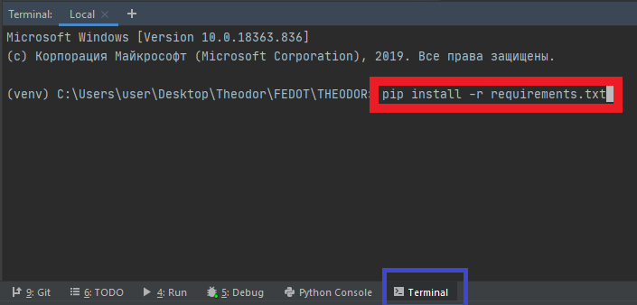

Quickstart
==========

FEDOT Framework quick start guide

How to install
--------------
.. code::

 pip install fedot

How to create your own composite model in manual way
----------------------------------------------------

-  **Step 1**. Specify problem type and choose dataset.

.. code:: python

   import pandas as pd

   model = Fedot(problem='classification')

   dataset_to_train = pd.read_csv(train_file_path)
   dataset_to_validate = pd.read_csv(train_file_path)

-  **Step 2**. Create *Chain* instance, create nodes with desired models

.. code:: python

   node_first = PrimaryNode('logit')
   node_second= PrimaryNode('xgboost')
   node_final = SecondaryNode('knn', nodes_from = [node_first, node_second])
   chain = Chain(node_final)

-  **Step 3**. Fit the chain using *fit* method.

.. code:: python

   model.fit(features=dataset_to_train, target='target', predefined_model=chain)

-  **Step 4**. Obtain the prediction using *predict* method.

.. code:: python

   prediction = model.predict(features=dataset_to_validate)

How to compose the chain in automated way
-----------------------------------------

.. code:: python

   auto_model = Fedot(problem='classification')
   pipeline = auto_model.fit(features=dataset_to_train, target='target')
   prediction = auto_model.predict(features=dataset_to_validate)
   auto_metrics = auto_model.get_metrics()

How to setup the development environments for the Fedot
-------------------------------------------------------

-  **Step 1**. *Download FEDOT Framework*.

   -  First of all, you need to clone the FEDOT Framework to your personal computer. You can do it directly using the button 'clone or download' (red square) or you can install IDE (e.g. PyCharm) and using the 'clone in Pycharm' button (blue square), which will open the files you need directly in the Pycharm project.

   -  For more details, take a look at the picture below.

        |Step 1|

-  **Step 2**. *Creating VirtualEnv in Pycharm project*.

   -  Next, you need to create virtual enviroment in your Pycharm
      project. To do this, go through the following sections:
      'File - Settings - Project Interpreter - Add new'.
   -  For more details, take a look at the picture below.

        |Step 2|

   -  After you have created a virtual environment, you should install
      the libraries necessary for the FEDOT framework to work. In order
      to do this, go to the terminal console (blue square) and run the
      following command *pip install -r requirements.txt* (red square).
   -  For more details, take a look at the picture below.

        |Step 3|

-  **Step 3**. *Manually installing libraries*.

   -  In order to use the

