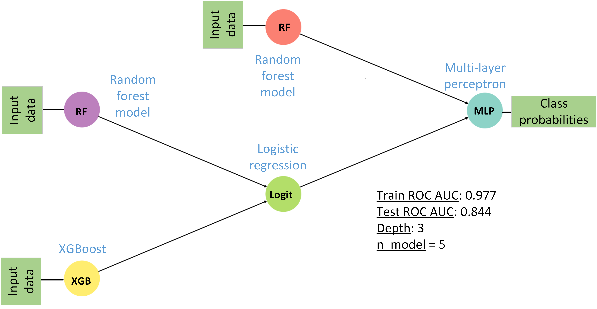
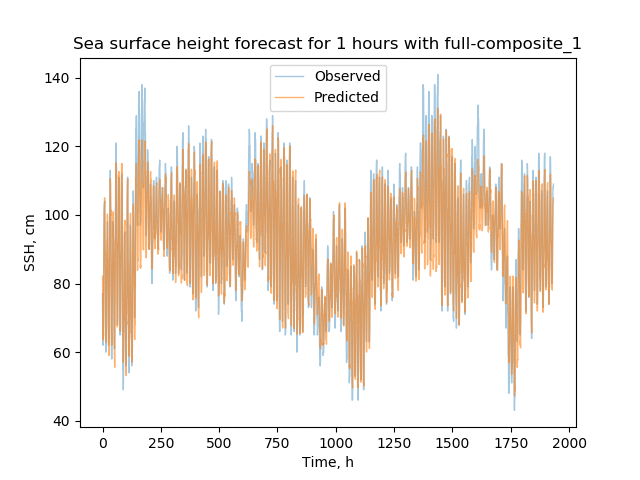

Real-world cases
================

We decided to prepare a set of real-world cases, that can be solved if
effective way using FEDOT.

The `first case`_ is the credit scoring problem (classification task).
The task is to predict the default event for the bank customer according
to the application data. The dataset is obtained from the `Kaggle
competition`_.

The `second case`_ is the metocean forecasting problem (multi-scale
random process regression task). The task is to create the N-step
forecast for sea surface height time series using historical values of
the process. The dataset is obtained from numerical simulation of the
Arctic ocean using the NEMO-LIM3 model setup (see the `paper`_ for
details).

The other cases are under development now.

.. _first case: /FEDOT.Docs/real_cases/credit-scoring
.. _Kaggle competition: https://www.kaggle.com/c/GiveMeSomeCredit
.. _second case: /FEDOT.Docs/real_cases/metocean-forecasting
.. _paper: https://www.sciencedirect.com/science/article/abs/pii/S1463500318301410

Credit Scoring problem
----------------------

The purpose of credit scoring is to assess and possibly reduce the risk
of a bank associated with lending clients. Risk minimization happens due
to dividing potential borrowers into creditworthy and non-creditworthy
borrowers. Division task = classification task. Behavioural scoring
involves an assessment of creditworthiness based on information about
the borrower, characterizing his behaviour and habits and obtained from
various sources.

Illustration of the credit scoring task:

For each of the borrowers, the probability of delay, related to the
scoring score, is estimated. Then it is necessary to set a border
separating “conscientious” and “unconscientious” borrowers.

**Data description**

Input data is obtained from open source:
https://www.kaggle.com/c/GiveMeSomeCredit

+-------+--------------------------------------+-------------------------------------------------------------------------------------------------------------------------------------------------------------------+
| **№** | **Parameter**                        | **Description**                                                                                                                                                   |
+-------+--------------------------------------+-------------------------------------------------------------------------------------------------------------------------------------------------------------------+
| 1     | SeriousDlqin2yrs                     | A label that the borrower has experience of payment delay for 90 days or more                                                                                     |
+-------+--------------------------------------+-------------------------------------------------------------------------------------------------------------------------------------------------------------------+
| 2     | RevolvingUtilizationOfUnsecuredLines | The total balance on credit card and personal credit lines, excluding real estate and initial debt contribution (for instance car credit divided by credit limits)|
+-------+--------------------------------------+-------------------------------------------------------------------------------------------------------------------------------------------------------------------+
| 3     | age                                  | Age of borrower (number of years)                                                                                                                                 |
+-------+--------------------------------------+-------------------------------------------------------------------------------------------------------------------------------------------------------------------+
| 4     | NumberOfTime30-59DaysPastDueNotWorse | Number of times the borrower had payment delays for 30-59 days (not more than 1-2 months) for the last 2 years                                                    |
+-------+--------------------------------------+-------------------------------------------------------------------------------------------------------------------------------------------------------------------+
| 5     | DebtRatio                            | The ratio of monthly expenses (including monthly loan payments, alimony, household expenses) to monthly total income                                              |
+-------+--------------------------------------+-------------------------------------------------------------------------------------------------------------------------------------------------------------------+
| 6     | MonthlyIncome                        | Monthly total income                                                                                                                                              |
+-------+--------------------------------------+-------------------------------------------------------------------------------------------------------------------------------------------------------------------+
| 7     | NumberOfOpenCreditLinesAndLoans      | Number of open loans (instalments, consumer credit (etc. car credit), mortgage) and credit lines (etc. credit cards)                                              |
+-------+--------------------------------------+-------------------------------------------------------------------------------------------------------------------------------------------------------------------+
| 8     | NumberOfTimes90DaysLate              | Number of times the borrower has payment delays for 90 days (3 months) or more                                                                                    |
+-------+--------------------------------------+-------------------------------------------------------------------------------------------------------------------------------------------------------------------+
| 9     | NumberRealEstateLoansOrLines         | Number of mortgages and loans to purchase real estate, including real estate loans                                                                                |
+-------+--------------------------------------+-------------------------------------------------------------------------------------------------------------------------------------------------------------------+
| 10    | NumberOfTime60-89DaysPastDueNotWorse | Number of times the borrower had payment delays for 60-89 days (not more than 2-3 months) for the last 2 years                                                    |
+-------+--------------------------------------+-------------------------------------------------------------------------------------------------------------------------------------------------------------------+
| 11    | NumberOfDependents                   | Number of dependants in the family not including the borrower himself:raw-latex:`herself `(spouse, children etc.)                                                 |
+-------+--------------------------------------+-------------------------------------------------------------------------------------------------------------------------------------------------------------------+

**Approaches to solving scoring task**

The credit scoring task can be solved using a single model. The figure
shows an example of scoring model quality metrics (ROC AUC, KS) on
single classifiers:

It is also possible to use an ensemble scoring model:

The ensembling make it possible to decrease the uncertainty in the
model. However, the structure of such a model may be non-trivial.
Therefore, it is better to use the GPComp algorithm to create a chain.
Example of GPComp convergence for a simple chain of scoring models:

.. figure::  img/img_scoring/GPComp-simple.gif
   :align:   center

Example of GPComp convergence for a more complex (multi-level) chain of
scoring models:

.. figure::  img/img_scoring/GPComp-multi.gif
   :align:   center

It can be seen that the GPComp algorithm converges more to a simpler
tree, which is clear by the specifics of the problem to be solved
(binary classification on a small number of features).

The best found model for the 30 minuter run is:

Metocean forecasting
--------------------

**Sea surface height forecasting problem**

One of the well-known modeling tasks is a simulation of the time series.
One of the real-world cases, connected with this task, is a metocean
forecasting. The prediction of the weather or climate in a single
spatial point is an actual and important problem for the many industrial
and R&D activities. To separate the metocean process into several
scales, an iterative approach can be used to extract each scale. This
approach consists of the application of the LSTM network and the
subtraction of its prediction results from the original time series.
Using this architecture, a non-linear trend can be distinguished from a
non-stationary time series during the first iteration. The next
iteration gives some resemblance to the seasonal component. The
advantage of this approach can be considered to be the extraction of the
trend and seasonal component without a priori assumptions about their
shape. However, the same feature can be understood as a disadvantage,
meaning the resulting components are less interpretable because a neural
network is used. As an example of the metocean forecasting task, the
time series of the surface height at the point obtained from the
modelling results of the NEMO model for the Arctic region was taken. An
LSTM model was used to predict values at the next point in time. Its
architecture is shown below.

A lag window equal to 12 hours was chosen for the experiment. Thus,
using values in the previous 12 hours to train the neural network, we
try to predict what will happen at the next point in time. At the
initial block of the model, Conv1d layers can be used to find patterns
in a time series (such as curvature). An adding noise layer from the
normal distribution to the input data was also added - this technique
helps to avoid over-learning of the model. The last TimeDistributed
layer converts the resulting features from the previous layers to the
output value. Inside it, a Dropout layer is used - which also helps
avoid over-learning.

Two decomposition scales are shown as an example. The first of them is a
trend component. An example of the highlighted trend is shown below.

On the left: selected trend component (orange) against the original time
series (full data set); on the right, the difference between the
selected trend and the original time series (the seasonal component).

On the left: the selected trend component (orange) vs the background of
the original time series (part of the dataset); on the right: the
difference between the selected trend and the original time series is
the seasonal component.

After training, the trend model was tested on a validation sample. All
validation samples, predictions and their difference (seasonal
component) is shown below. Top-down: the resulting trend model,
validation sample and their difference:

The resulting trend model has a standard error of 0.01 m on the
validation sample.

The model for the seasonal component was obtained similarly. The results
of the validation sample prediction are shown below. The result of
predicting the seasonal component model (orange) on the entire
validation sample (blue).

The result of predicting the seasonal component model (orange) was
compared with the validation sample (blue).

The resulting seasonal component model has a standard error of 0.03 m on
the validation sample.

The implementation of such structure (LSTM+regression model for
different scales) as Fedot composite model can be represented as
follows:

So, the implementation of the described model can be obtained by
following code:

.. code:: python

   chain = Chain()
   node_trend = NodeGenerator.primary_node(ModelTypesIdsEnum.trend_data_model)
   node_lstm_trend = NodeGenerator.secondary_node(ModelTypesIdsEnum.lstm, nodes_from=[node_trend])

   node_residual = NodeGenerator.primary_node(ModelTypesIdsEnum.residual_data_model)
   node_ridge_residual = NodeGenerator.secondary_node(ModelTypesIdsEnum.ridge, nodes_from=[node_residual])

   node_final = NodeGenerator.secondary_node(ModelTypesIdsEnum.additive_data_model,
                                             nodes_from=[node_ridge_residual, node_lstm_trend])
   chain.add_node(node_final)

To obtain a forecast, the chain_lstm.predict(dataset_to_validate) should
be called.

The forecasts with different depth are differs as:

The example of the optimisation for the predictive chain:

.. figure::  img/img_metocean/ts_opt.gif
   :align:   center