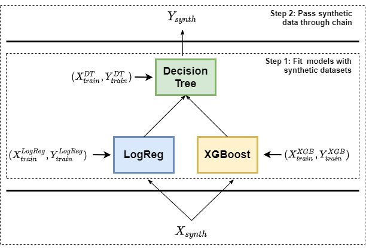

The utility for generation of synthetic benchmarks
--------------------------------------------------

As a part of FEDOT framework, we provide a simple API for the generation
of ready-to-use synthetic chains, datasets, and benchmarks.

Check ``utilities/synthetic`` package for details.

**Synthetic datasets**

``utilities/synthetic/data.py`` contains wrappers of Scikit-Learn
‘make_datasets’ functions: - ``classification_dataset`` - generates a
random dataset for n-class classification problem. -
``gauss_quantiles_dataset`` - generates a random dataset for n-class
classification problem based on multi-dimensional gaussian distribution
quantiles.

Example of usages can be seen in ``examples/data_generator_example`` and
``test/test_synthetic_data.py``.

**Chain generation**

``utilities/synthetic/chain.py`` contains several functions to generate
random chains with parameters, such as tree depth, the number of nodes
per level, and model types to be encapsulated in the nodes. -
``chain_with_fixed_structure`` - generates chain with a fixed structure
of nodes and links (*not implemented yet*). -
``chain_with_random_links`` - generates a chain with a fixed structure
of nodes but random links. - ``chain_full_random`` - generates a chain
with a random amount of nodes and links. - ``chain_balanced_tree`` -
generates a chain with a balanced tree-like structure. The average arity
value of the resulted tree is close to 2.

Example of usages can be seen in ``test/test_synthetic_chain.py``

**Synthetic benchmarks**

In order to test the performance, robustness, etc. of the composing
algorithms, various benchmark datasets can be useful. This is ongoing
research conducting by our team.

Currently, the utility provides the following benchmark generation
schema: 1. A chain with a balanced binary tree structure with a fixed
value of a tree depth is generated. Each model in the nodes is selected
randomly from a predefined set of ML models. 2. Each model is fitted
independently by synthetically generated datasets (using
``gauss_quantiles_dataset``). 3. Using the same approach a test dataset
is generated and passed through the chain obtaining the predictions.

See ``utilities/synthetic/data_benchmark.py`` for the details and
``examples/synthetic_benchmark_composing_example`` as an example of
usages.

