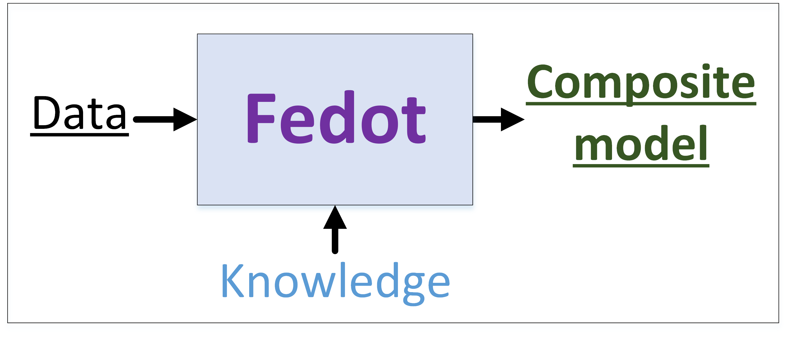

.. FEDOT documentation master file, created by
   sphinx-quickstart on Fri Aug 28 15:26:44 2020.
   You can adapt this file completely to your liking, but it should at least
   contain the root `toctree` directive.

Welcome to FEDOT's documentation!
=================================

This site contains documentation for the `Fedot framework <https://github.com/nccr-itmo/FEDOT>`__, its description, tutorials, and application examples.

Fedot is a framework for automated modelling and machine learning, aimed to create the complex composite models that allow the obtain the efficient solution of various applied problems.

The main aim of the Fedot - to improve the quality of analysis of various natural, technical, and social processes by the automated identification of the composite models from available data sets.

Content
=======
.. toctree::
   :maxdepth: 1

   autolearning/index
   fedot/index
   contribution
   faq
   about
   modules

Indices and tables
==================

* :ref:`genindex`
* :ref:`modindex`
* :ref:`search`
