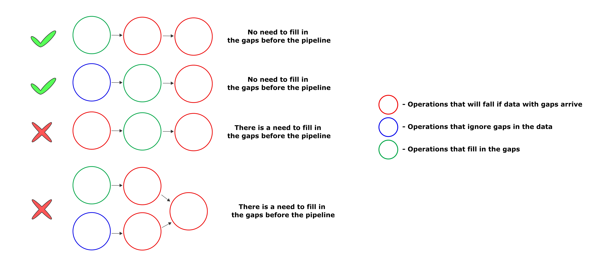

Involved tasks
--------------

FEDOT is currently capable of solving:

* `Classification <https://github.com/stockblog/webinar_automl_fedot/blob/main/FEDOT%20Tutorial%20-%20Classification.ipynb>`_
* `Regression <https://github.com/stockblog/webinar_automl_fedot/blob/main/FEDOT%20Tutorial%20-%20Regression.ipynb>`_
* `Time-series forecasting ([uni/multi]variate) <https://github.com/stockblog/webinar_automl_fedot/blob/main/FEDOT%20Tutorial%20-%20Timeseries%20Forecasting.ipynb>`_

Pipeline building
-----------------

FEDOT uses open-source library named `GOLEM <https://github.com/aimclub/GOLEM#graph-optimization-and-learning-by-evolutionary-methods>`_
for optimization and learning of graph-based pipelines with meta-heuristic methods.

The library is potentially applicable to any graph-based optimization problem with clearly defined fitness function on it.

Sure enough, you may use your own custom optimization algorithms, see :doc:`/advanced/automated_pipelines_design`.

Data preprocessing
------------------

FEDOT uses two types of preprocessing: obligatory and optional.

.. note::

    Preprocessing is optional (see ``use_input_preprocessing`` :doc:`main API parameter </api/api>`),
    so you can save some time if your dataset (input data) is already preprocessed.

**Obligatory preprocessing**, as you might guess, solves major problems that can disrupt or complicate data processing,
such as:

.. list-table:: Obligatory preprocessing
   :widths: 25 5
   :header-rows: 1

   * - Problem
     - Solution
   * - 'inf' values in features
     - replace
   * - huge amount of nans in features or targets
     - drop
   * - binary categorical form of the features or targets
     - binarize
   * - extra spaces in categorical features
     - trim

**Optional preprocessing** depends on a composed pipeline structure, and is applied only if
it is necessary for a next model from a processing queue to work.

.. list-table:: Optional preprocessing
   :widths: 10 5
   :header-rows: 1

   * - Problem
     - Solution
   * - nans in features
     - impute
   * - non-binary categorical features
     - LabelEncode or OneHotEncode

But depending on the pipeline structure, it might be ommited:

.. seealso::
    :doc:`Extended explanation </advanced/data_preprocessing>`

.. note::

    Both obligatory and optional preprocessing are applied only once.
