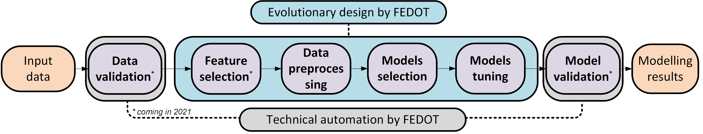
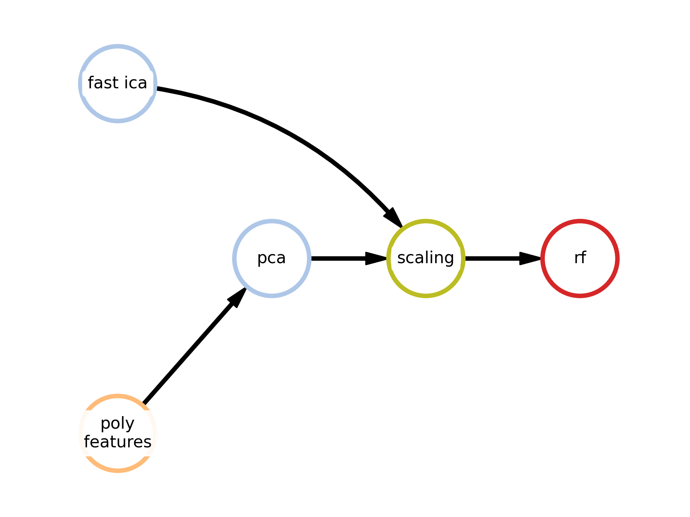

Intro to FEDOT
==============

FEDOT is an open-source framework for automated modeling and machine learning (AutoML). It produces a lightweight end-to-end ML solution in an automated way using an evolutionary approach.

|FEDOT logo|

FEDOT supports classification (binary and multiclass), regression, and time series forecasting tasks. FEDOT works both on unimodal (only tabular/image/text data) and multimodal data (more than one data source).

|Pipeline schema|

FEDOT supports a full life-сyсle of machine learning task that includes preprocessing, model selection, tuning, cross validation and serialization.

.. code-block:: python

    model = Fedot(problem='classification', timeout=5, preset='best_quality', n_jobs=-1)
    model.fit(features=x_train, target=y_train)
    prediction = model.predict(features=x_test)
    metrics = model.get_metrics(target=y_test)

Once FEDOT finds the best solution you have an opportunity to save it[link] and look closer to the solution and optimization process if needed.

|Example of solution|

Framework uses ML models mostly from sklearn, statsmodels and keras libraries.

To see more information about FEDOT features go to the `features <https://fedot.readthedocs.io/en/latest/introduction/fedot_features.html>`_ page.
To see a quickstart guide go to the `quickstart <https://fedot.readthedocs.io/en/latest/introduction/tutorial/quickstart.html>`_ page.
