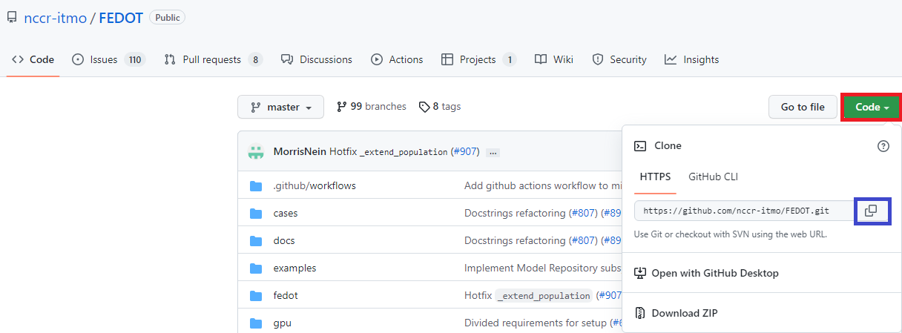

The GitHub way
--------------

-  **Step 1**. *Download FEDOT Framework*.

   -  First of all, you need to clone the FEDOT Framework to your personal computer.
      You can do it directly using the button `Code` (red square) and then copying
      a link to the repository (blue square).

         |Step 1|
   
   -  Then open cmd(Windows) or terminal(Unix like OS), type in:

      .. code-block::
      
         $ git clone https://github.com/nccr-itmo/FEDOT.git
         $ cd FEDOT

-  **Step 2**. *Creating VirtualEnv*.

   -  Next, you need to create a virtual environment in your project
      for excluding libraries incompatibility and confusion.
      To do this, type in
      
      .. code-block::

         $ python -m venv <your_venv_path>

      .. include:: ./activating_venv.rst

   -  After you have created the virtual environment, you should install
      the libraries necessary for the FEDOT framework to work.
      Here you need to type in the following:
      
      .. code-block:: 
      
         $ pip install .

   -  But, if you want to be able to run NNs examples and all other specific stuff,
      you'll need to run full installation option.

      To do this, go to the terminal console and run the
      following command
   
      .. code-block::
      
         $ pip install .[extra]

