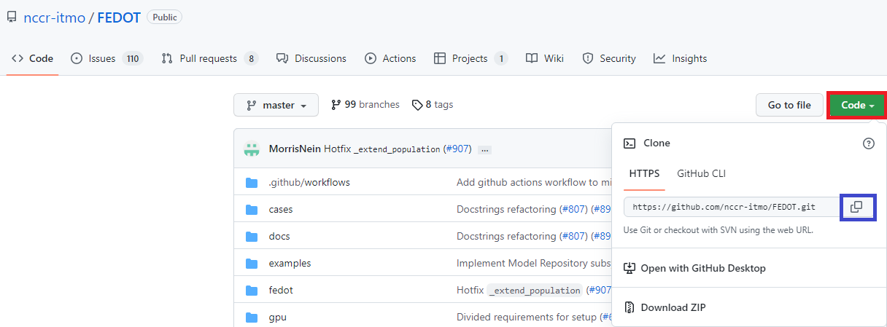
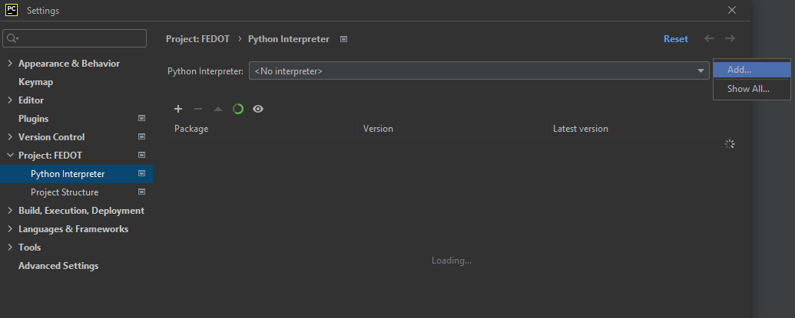
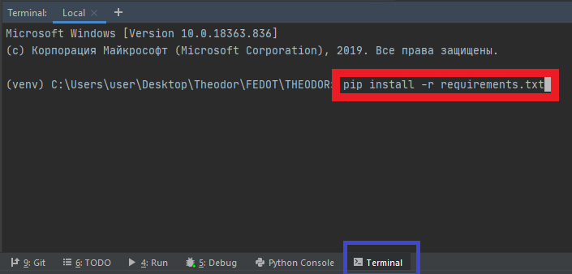
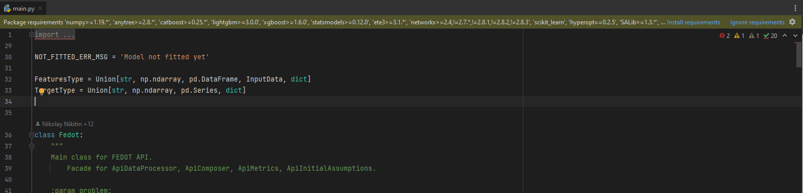
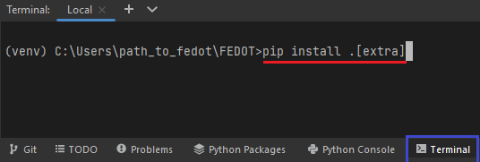

How to setup the environment using PyCharm
-------------------------------------------------------

-  **Step 1**. *Download FEDOT Framework*.

   -  First of all, you need to clone the FEDOT Framework to your personal computer.
      You can do it directly using the button 'clone or download' (red square) or
      using PyCharm, you should be able to use 'clone in Pycharm'
      button (blue square), which will open the files you need directly
      in the Pycharm project.

   -  For more details, take a look at the picture below.

        |Step 1|

-  **Step 2**. *Creating VirtualEnv in Pycharm project*.

   -  Next, you need to create the virtual environment in your Pycharm
      project for excluding libraries incompatibility and confusion. To do this, go through the following sections:
      'File - Settings - Project: FEDOT - Python Interpreter - <gears icon> - Add...'.
   -  For more details, take a look at the pictures below.

        |Step 2|

        |Step 2.1|

   -  After you have created a virtual environment, you should install
      the libraries necessary for the FEDOT framework to work.
      If you open any file associated with project,
      IDE will notify you to install or ignore project root requirements:

        |Step 2.2|

   -  But, if you want to be able to run NNs examples, you'll need to install
      other libs manually.
      To do this, go to the terminal console (blue square) and run the
      following command *pip install .[extra]* (red line).
      For more details, take a look at the picture below.

        |Step 2.3|

.. include:: manual_installation.rst

